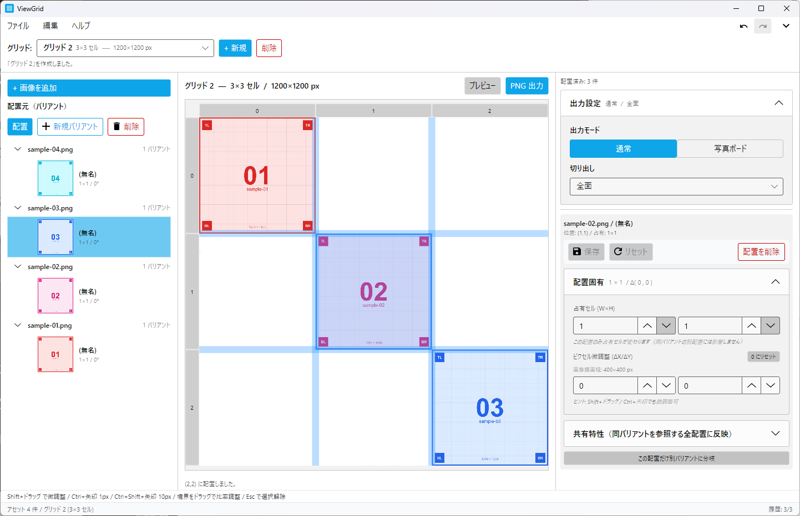
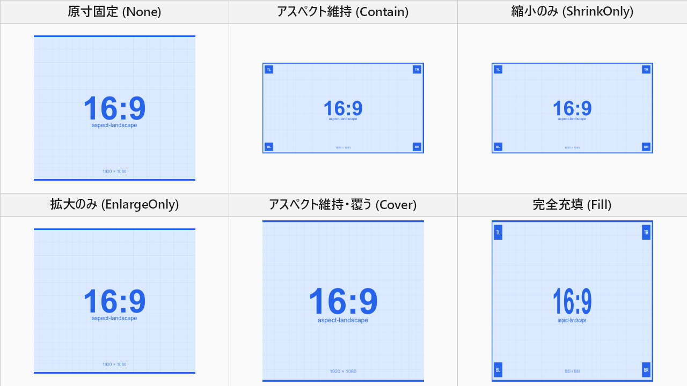
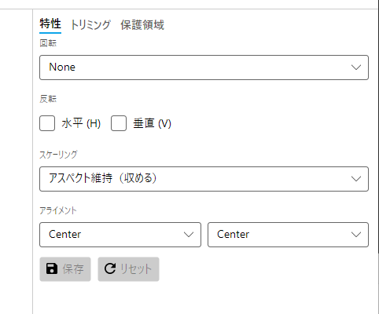
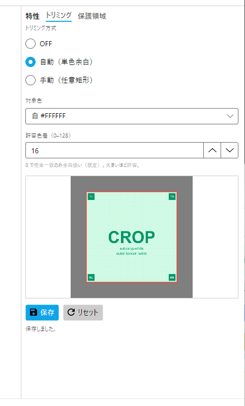
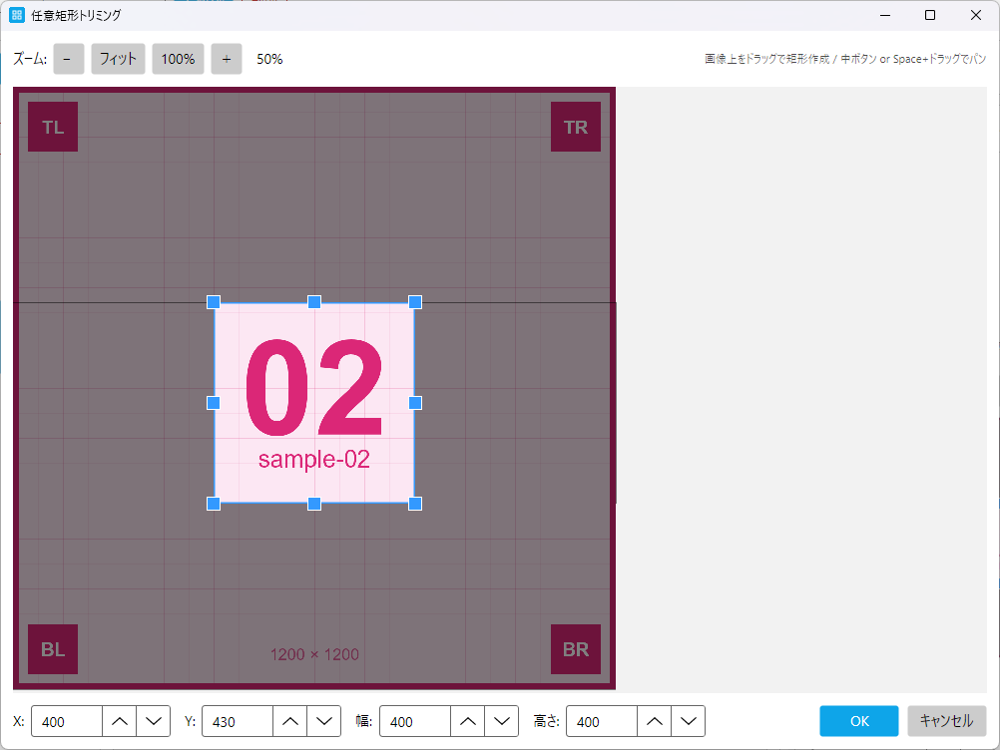
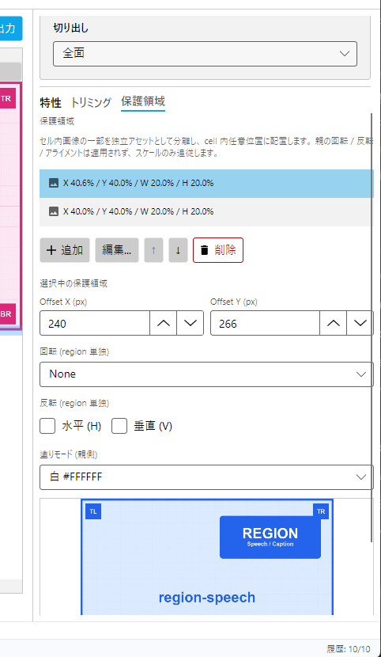
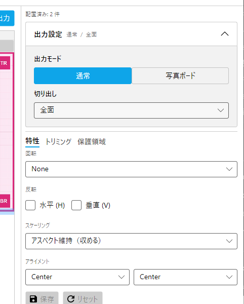
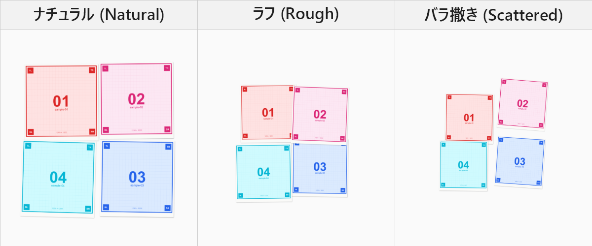
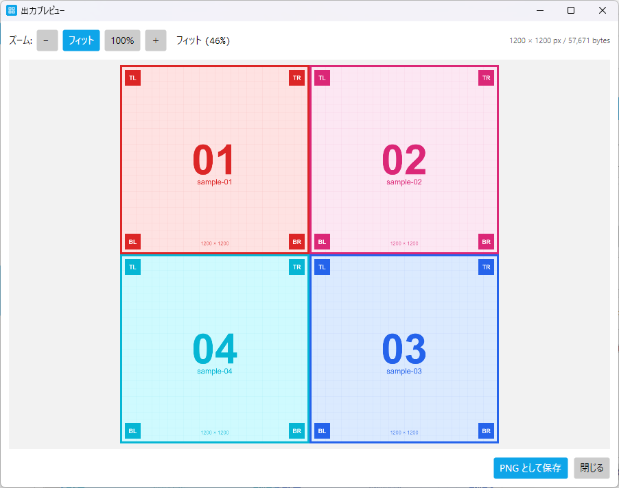
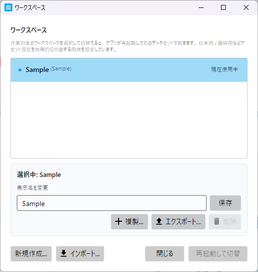

# CAPTURE Review (自動生成)

> このページは `tools/CaptureToolkit -- generate-review` で再生成されます。 手動編集しないこと。
> 撮影フェーズ完了後、 placeholder を実画像で上書き → 本ページを再生成 → ✅ 状態を確認してください。

## 進捗サマリ

- 合計: **25** 件
- ✅ 撮影済 (placeholder 上書き済): **25**
- ❌ Placeholder のまま: **0**

## `quickstart.md`

### ✅ `qs-01-01-main-window-overview.png`

| 項目 | 内容 |
|---|---|
| File | `docs/images/qs/qs-01-01-main-window-overview.png` |
| Size | 1280×800 |
| Samples | sample-01.png, sample-02.png, sample-03.png, sample-04.png |
| Caption | アプリ起動後の全体像 (3 ペイン構成) |
| Status | ✅ Replaced |
| Source | `quickstart.md:19` |

**State**:

- ワークスペース: Default (新規作成直後)
- アセット: sample-01〜04 を取り込み済み
- グリッド: 2×2 (キャンバス 1200×1200)、 配置 2 〜 3 件 (sample-01 を左上 + sample-03 を右下 等)
- 言語: 日本語
- 右ペイン: 何も選択していないデフォルト Hint 表示

**Review checklist**:
- [ ] サイズ一致 (placeholder の Size と実画像の寸法)
- [ ] サンプル画像一致 (Samples 通りの画像が映っている)
- [ ] State 通りの構図
- [ ] 言語設定 ja

---

### ✅ `qs-03-01-drag-drop-images.png`

| 項目 | 内容 |
|---|---|
| File | `docs/images/qs/qs-03-01-drag-drop-images.png` |
| Size | 1280×800 |
| Samples | sample-01.png, sample-02.png, sample-03.png, sample-04.png (エクスプローラ上の 4 ファイル) |
| Caption | 画像をエクスプローラからドラッグ&ドロップで取り込む |
| Note | ドラッグ中の半透明アイコン + Copy カーソルが見える構図。 ViewGrid 側はパネル全体のハイライトは現状未実装 (OS カーソル変化のみで判別) |
| Status | ✅ Replaced |
| Source | `quickstart.md:56` |

**State**:

- ワークスペース: 空 (Default 直後)
- エクスプローラから sample-01〜04 の 4 枚を選択してメインウィンドウへドラッグ中
- カーソル: OS の Copy インジケータ (+ マーク) が表示されている (受入可)
- 言語: 日本語

**Review checklist**:
- [ ] サイズ一致 (placeholder の Size と実画像の寸法)
- [ ] サンプル画像一致 (Samples 通りの画像が映っている)
- [ ] State 通りの構図
- [ ] 言語設定 ja

---

### ✅ `qs-03-02-create-grid-flyout.png`

| 項目 | 内容 |
|---|---|
| File | `docs/images/qs/qs-03-02-create-grid-flyout.png` |
| Size | 880×330 |
| Samples | (サンプル画像不要、 UI のみ) |
| Caption | 新規グリッド作成フライアウト (列 2 × 行 2、 1200×1200 px) |
| Note | フォーカスは名前入力欄に当たっている状態。 raw は docs/images/_raw/qs/qs-03-02-create-grid-flyout.png |
| Status | ✅ Replaced |
| Source | `quickstart.md:77` |

**State**:

- 「+ 新規」 を押して作成フライアウトが開いた直後
- 入力値: 名前 「グリッド 1」 / 列 2 / 行 2 / キャンバス幅 1200 / 高さ 1200
- 言語: 日本語

**Review checklist**:
- [ ] サイズ一致 (placeholder の Size と実画像の寸法)
- [ ] サンプル画像一致 (Samples 通りの画像が映っている)
- [ ] State 通りの構図
- [ ] 言語設定 ja

---

### ✅ `qs-03-03-drag-to-cell.png`

| 項目 | 内容 |
|---|---|
| File | `docs/images/qs/qs-03-03-drag-to-cell.png` |
| Size | 1280×800 |
| Samples | sample-01 (左上配置済み), sample-02 (ドラッグ中) |
| Caption | 候補からセルへドラッグ&ドロップ |
| Note | ドラッグ中のサムネプレビュー + 配置先セルのハイライト + 配置済みセルが同時に見える |
| Status | ✅ Replaced |
| Source | `quickstart.md:98` |

**State**:

- グリッド 2×2 (キャンバス 1200×1200) 作成済み
- 左上セルに sample-01 配置済み
- 候補リストの sample-02 をドラッグ中で、 右上セルにホバー (緑のハイライト)
- 言語: 日本語

**Review checklist**:
- [ ] サイズ一致 (placeholder の Size と実画像の寸法)
- [ ] サンプル画像一致 (Samples 通りの画像が映っている)
- [ ] State 通りの構図
- [ ] 言語設定 ja

---

### ✅ `qs-03-04-preview-window.png`

| 項目 | 内容 |
|---|---|
| File | `docs/images/qs/qs-03-04-preview-window.png` |
| Size | 1280×800 |
| Samples | sample-01〜04 (2×2 配置済み) |
| Caption | プレビューウィンドウで仕上がりを確認 |
| Note | ズームバーの 「フィット」 「100%」 ボタンが見える位置 (実 UI は 「−」 「フィット」 「100%」 「＋」 の 4 つ) |
| Status | ✅ Replaced |
| Source | `quickstart.md:119` |

**State**:

- sample-01〜04 を 2×2 グリッドに配置済みのプレビューウィンドウ
- 拡大率: 100% (物理ピクセル等倍)
- 言語: 日本語

**Review checklist**:
- [ ] サイズ一致 (placeholder の Size と実画像の寸法)
- [ ] サンプル画像一致 (Samples 通りの画像が映っている)
- [ ] State 通りの構図
- [ ] 言語設定 ja

---

### ✅ `qs-03-05-export-png-dialog.png`

| 項目 | 内容 |
|---|---|
| File | `docs/images/qs/qs-03-05-export-png-dialog.png` |
| Size | 800×600 |
| Samples | (サンプル画像不要、 OS ダイアログのみ) |
| Caption | OS ネイティブの保存ダイアログ |
| Note | ダイアログタイトル 「PNG として保存」 が確実に見える |
| Status | ✅ Replaced |
| Source | `quickstart.md:135` |

**State**:

- Export PNG ボタン押下後の Windows の 「PNG として保存」 ダイアログ
- ファイル名候補: viewgrid-export.png (または現状の自動命名)
- 言語: 日本語

**Review checklist**:
- [ ] サイズ一致 (placeholder の Size と実画像の寸法)
- [ ] サンプル画像一致 (Samples 通りの画像が映っている)
- [ ] State 通りの構図
- [ ] 言語設定 ja

---

## `user-manual/01-concepts.md`

### ✅ `um-01-03-main-window-3pane.png`

| 項目 | 内容 |
|---|---|
| File | `docs/images/um/um-01-03-main-window-3pane.png` |
| Size | 1280×800 |
| Samples | sample-01, sample-02, sample-03 (アセット 3 枚 + 配置 3 件) |
| Caption | メインウィンドウの 3 ペイン構成 (左: グリッド一覧、 中央: キャンバス、 右: Inspector / 候補) |
| Note | ペインの境界線とラベル位置がはっきり分かる構図 |
| Status | ✅ Replaced |
| Source | `user-manual/01-concepts.md:78` |

**State**:

- グリッド 2 件存在、 1 件目アクティブ (3×3 想定)
- 配置 3 件 (sample-01 左上 / sample-02 中央 / sample-03 右下)、 中央 sample-02 が選択中 (DodgerBlue の選択枠 + 半透明青塗り)
- 右ペイン Inspector に選択中配置の特性表示
- 言語: 日本語

**Review checklist**:
- [ ] サイズ一致 (placeholder の Size と実画像の寸法)
- [ ] サンプル画像一致 (Samples 通りの画像が映っている)
- [ ] State 通りの構図
- [ ] 言語設定 ja

---

## `user-manual/02-assets.md`

### ✅ `um-02-04-add-images-picker.png`

| 項目 | 内容 |
|---|---|
| File | `docs/images/um/um-02-04-add-images-picker.png` |
| Size | 800×600 |
| Samples | (サンプル画像不要、 ピッカーのみ。 ただしリストに sample-*.png が見えていると分かりやすい) |
| Caption | 画像取り込み用のファイルピッカー |
| Note | ピッカーのタイトルとフィルタ名が見える |
| Status | ✅ Replaced |
| Source | `user-manual/02-assets.md:21` |

**State**:

- メニュー / ボタンから OpenFilePicker を起動した直後
- タイトル: 「画像を選択」 (日本語版なので)
- フィルタ: 「画像 (*.png; *.jpg; ...)」
- ピッカーの一覧に docs/sample-images/ を開いて sample-*.png が並んだ状態が望ましい

**Review checklist**:
- [ ] サイズ一致 (placeholder の Size と実画像の寸法)
- [ ] サンプル画像一致 (Samples 通りの画像が映っている)
- [ ] State 通りの構図
- [ ] 言語設定 ja

---

### ✅ `um-02-05-add-variant.png`

| 項目 | 内容 |
|---|---|
| File | `docs/images/um/um-02-05-add-variant.png` |
| Size | 400×600 |
| Samples | sample-01 (アセット元)、 sample-01 のバリアント 2 件 |
| Caption | 候補リストからバリアントを追加 |
| Status | ✅ Replaced |
| Source | `user-manual/02-assets.md:68` |

**State**:

- sample-01.png のアセットグループを展開済み (バリアント 2 件: 「(無名)」 と任意名のコピー 1 件)
- 候補ペイン下部に「新規バリアント」 ボタン (+ アイコン付き) が見える

**Review checklist**:
- [ ] サイズ一致 (placeholder の Size と実画像の寸法)
- [ ] サンプル画像一致 (Samples 通りの画像が映っている)
- [ ] State 通りの構図
- [ ] 言語設定 ja

---

## `user-manual/03-grids.md`

### ✅ `um-03-06-create-grid-flyout.png`

| 項目 | 内容 |
|---|---|
| File | `docs/images/um/um-03-06-create-grid-flyout.png` |
| Size | 880×330 |
| Samples | (サンプル画像不要、 UI のみ) |
| Caption | 新規グリッド作成フライアウト |
| Note | 全フィールドと作成 / キャンセルボタンが見える |
| Status | ✅ Replaced |
| Source | `user-manual/03-grids.md:20` |

**State**:

- 作成フライアウト展開、 既定値そのまま (グリッド N / 3×3 / 1200×1200)
- 言語: 日本語

**Review checklist**:
- [ ] サイズ一致 (placeholder の Size と実画像の寸法)
- [ ] サンプル画像一致 (Samples 通りの画像が映っている)
- [ ] State 通りの構図
- [ ] 言語設定 ja

---

### ✅ `um-03-06-grid-properties.png`

| 項目 | 内容 |
|---|---|
| File | `docs/images/um/um-03-06-grid-properties.png` |
| Size | 482×600 |
| Samples | (サンプル画像不要、 グリッドのみ選択) |
| Caption | 右ペインのグリッド設定 (ドラフト編集 + 保存ボタン) |
| Status | ✅ Replaced |
| Source | `user-manual/03-grids.md:38` |

**State**:

- グリッド選択中 (配置なし or 配置あり問わず)、 右ペインにグリッド設定が表示
- 名前を編集してドラフト状態 (● バッジ表示)

**Review checklist**:
- [ ] サイズ一致 (placeholder の Size と実画像の寸法)
- [ ] サンプル画像一致 (Samples 通りの画像が映っている)
- [ ] State 通りの構図
- [ ] 言語設定 ja

---

### ✅ `um-03-07-boundary-drag.png`

| 項目 | 内容 |
|---|---|
| File | `docs/images/um/um-03-07-boundary-drag.png` |
| Size | 580×790 |
| Samples | sample-01〜06 (3×3 のうち 6 セル配置済み、 grid 線で境界の動きが視認可能) |
| Caption | 境界ドラッグで列幅を調整 |
| Status | ✅ Replaced |
| Source | `user-manual/03-grids.md:57` |

**State**:

- グリッド 3×3 (1500×1500 程度のキャンバス) に sample-01〜06 を配置
- 中央列の左境界をドラッグ中、 境界線が太く強調表示
- sample 画像の grid 線で境界の動きが pixel 単位で読み取れる

**Review checklist**:
- [ ] サイズ一致 (placeholder の Size と実画像の寸法)
- [ ] サンプル画像一致 (Samples 通りの画像が映っている)
- [ ] State 通りの構図
- [ ] 言語設定 ja

---

## `user-manual/04-placements.md`

### ✅ `um-04-09-drop-valid.png`

| 項目 | 内容 |
|---|---|
| File | `docs/images/um/um-04-09-drop-valid.png` |
| Size | 580×790 |
| Samples | sample-01 (配置済み), sample-02 (ドラッグ中) |
| Caption | 有効なドロップ先のホバー (緑ハイライト) |
| Status | ✅ Replaced |
| Source | `user-manual/04-placements.md:15` |

**State**:

- sample-01 が左上セルに配置済み
- 候補から sample-02 をドラッグ中、 右上 1×1 セルにホバーで緑ハイライト

**Review checklist**:
- [ ] サイズ一致 (placeholder の Size と実画像の寸法)
- [ ] サンプル画像一致 (Samples 通りの画像が映っている)
- [ ] State 通りの構図
- [ ] 言語設定 ja

---

### ✅ `um-04-10-inspector.png`

| 項目 | 内容 |
|---|---|
| File | `docs/images/um/um-04-10-inspector.png` |
| Size | 482×800 |
| Samples | sample-01 (配置 + 選択中) |
| Caption | Inspector の構造 (配置固有 + 共有特性、 上部に保存バー + 配置削除) |
| Status | ✅ Replaced |
| Source | `user-manual/04-placements.md:47` |

**State**:

- sample-01 を配置 + 選択中、 Inspector 表示
- 「配置固有」 Expander 展開済み (占有セル + ピクセル微調整)
- 「共有特性」 Expander 折り畳み済み (出力設定と同じ折り畳みパターン)

**Review checklist**:
- [ ] サイズ一致 (placeholder の Size と実画像の寸法)
- [ ] サンプル画像一致 (Samples 通りの画像が映っている)
- [ ] State 通りの構図
- [ ] 言語設定 ja

---

## `user-manual/05-shared-properties.md`

### ✅ `um-05-11-scaling-modes.png`

| 項目 | 内容 |
|---|---|
| File | `docs/images/um/um-05-11-scaling-modes.png` |
| Size | 1280×720 |
| Samples | aspect-landscape.png (1:1 セルに配置、 アスペクト不一致を起こす素材として最適) |
| Caption | 6 スケーリングモードの比較 |
| Note | tools/CaptureToolkit -- compose-scaling で 6 PNG (docs/images/_raw/composites/scaling-modes/1-None.png 〜 6-Fill.png) を 3×2 グリッドへ自動合成。 各サンプルの 4 隅マーカー位置を比較すると違いが明確 |
| Status | ✅ Replaced |
| Source | `user-manual/05-shared-properties.md:61` |

**State**:

- aspect-landscape (1920×1080) を 1:1 セル (例: 600×600) に配置
- 同じ配置を 6 モード (Original / Contain / ShrinkOnly / EnlargeOnly / Cover / Stretch) で出力
- キャプション付きで並べた合成画像

**Review checklist**:
- [ ] サイズ一致 (placeholder の Size と実画像の寸法)
- [ ] サンプル画像一致 (Samples 通りの画像が映っている)
- [ ] State 通りの構図
- [ ] 言語設定 ja

---

### ✅ `um-05-11-alignment.png`

| 項目 | 内容 |
|---|---|
| File | `docs/images/um/um-05-11-alignment.png` |
| Size | 482×400 |
| Samples | (サンプル画像不要、 UI のみ) |
| Caption | 共有特性編集タブ (特性) の構造 |
| Note | 実装上 アライメントは ComboBox 2 つ (AlignX / AlignY)。 spec が想定していた「3×3 ラジオボタン + 矢印アイコン」 は未実装 (将来の UI 改善候補) |
| Status | ✅ Replaced |
| Source | `user-manual/05-shared-properties.md:94` |

**State**:

- 候補リストでバリアントを選択中 (右ペインに 特性 タブが開いている)
- 特性タブの内容: 回転 (None) / 反転 (水平 / 垂直) / スケーリング (アスペクト維持（収める）) / アライメント X+Y (両方 Center)
- 下部に 保存 / リセット ボタン (グレーアウト = 未編集)

**Review checklist**:
- [ ] サイズ一致 (placeholder の Size と実画像の寸法)
- [ ] サンプル画像一致 (Samples 通りの画像が映っている)
- [ ] State 通りの構図
- [ ] 言語設定 ja

---

### ✅ `um-05-13-autocrop.png`

| 項目 | 内容 |
|---|---|
| File | `docs/images/um/um-05-13-autocrop.png` |
| Size | 482×800 |
| Samples | autocrop-white.png (外周 200px 白余白 + 内側 1200×1200 の subject) |
| Caption | AutoCrop 設定 + プレビューサムネ上の検出矩形 |
| Note | 白プリセット/黒プリセット/透明プリセット の比較で 3 枚撮るなら、 autocrop-black/transparent も同じ構図で |
| Status | ✅ Replaced |
| Source | `user-manual/05-shared-properties.md:178` |

**State**:

- autocrop-white.png のバリアントを選択中
- トリミング: 「自動（単色余白）」 選択中
- 対象色: 白 #FFFFFF
- 許容色差スライダー値 16 程度
- プレビューサムネに検出された crop 矩形 (1200×1200 部分) が点線で表示

**Review checklist**:
- [ ] サイズ一致 (placeholder の Size と実画像の寸法)
- [ ] サンプル画像一致 (Samples 通りの画像が映っている)
- [ ] State 通りの構図
- [ ] 言語設定 ja

---

### ✅ `um-05-13-manualcrop-editor.png`

| 項目 | 内容 |
|---|---|
| File | `docs/images/um/um-05-13-manualcrop-editor.png` |
| Size | 1024×768 |
| Samples | sample-01 (grid 線 + 4 隅マーカーで矩形位置が読み取りやすい) |
| Caption | ManualCrop 詳細編集ダイアログ (8 ハンドル + マット表示 + 数値入力) |
| Note | sample-01 の grid 線で矩形の位置が pixel 単位で視認できる |
| Status | ✅ Replaced |
| Source | `user-manual/05-shared-properties.md:211` |

**State**:

- sample-01.png のバリアントで ManualCrop 詳細編集ダイアログを開いた状態
- 拡大率 400%、 矩形編集中 (8 ハンドル表示)
- 数値入力欄に値が入っている (例: X=200, Y=200, W=800, H=800)

**Review checklist**:
- [ ] サイズ一致 (placeholder の Size と実画像の寸法)
- [ ] サンプル画像一致 (Samples 通りの画像が映っている)
- [ ] State 通りの構図
- [ ] 言語設定 ja

---

### ✅ `um-05-14-region-tab.png`

| 項目 | 内容 |
|---|---|
| File | `docs/images/um/um-05-14-region-tab.png` |
| Size | 482×830 |
| Samples | region-speech.png (吹き出し風 region が分かりやすい元画像) |
| Caption | 保護領域タブの構造 (リスト + 選択中の詳細編集) |
| Status | ✅ Replaced |
| Source | `user-manual/05-shared-properties.md:246` |

**State**:

- region-speech.png のバリアントを選択中、 保護領域タブ展開
- region 2 件登録済み (1 件目: 吹き出し領域に合わせた region、 2 件目: 別領域)
- 1 件目選択中で詳細編集パネル表示 (Offset / Rotation / Flip / FillMode)

**Review checklist**:
- [ ] サイズ一致 (placeholder の Size と実画像の寸法)
- [ ] サンプル画像一致 (Samples 通りの画像が映っている)
- [ ] State 通りの構図
- [ ] 言語設定 ja

---

## `user-manual/06-output.md`

### ✅ `um-06-15-output-settings.png`

| 項目 | 内容 |
|---|---|
| File | `docs/images/um/um-06-15-output-settings.png` |
| Size | 482×600 |
| Samples | sample-01〜04 (2×2 配置済み、 背景に少し見える) |
| Caption | 出力設定の展開状態 (モード / スタイル / 強度 / 切り出し) |
| Status | ✅ Replaced |
| Source | `user-manual/06-output.md:16` |

**State**:

- sample-01〜04 を 2×2 グリッドに配置済み
- 右ペインの出力設定 Expander 展開、 通常モード / 全面切り出し
- 折り畳み時のヘッダ要約 「通常 / 全面」 も別カットがあれば追加

**Review checklist**:
- [ ] サイズ一致 (placeholder の Size と実画像の寸法)
- [ ] サンプル画像一致 (Samples 通りの画像が映っている)
- [ ] State 通りの構図
- [ ] 言語設定 ja

---

### ✅ `um-06-16-photoboard-styles.png`

| 項目 | 内容 |
|---|---|
| File | `docs/images/um/um-06-16-photoboard-styles.png` |
| Size | 1200×500 |
| Samples | photo-01.png, photo-02.png, photo-03.png, photo-04.png (写真風画像で PhotoBoard の効果が映える) |
| Caption | PhotoBoard 3 スタイルの比較 |
| Note | 合成画像。 tools/CaptureToolkit -- compose-photoboard で 3 PNG を 3×1 グリッドで自動合成 |
| Status | ✅ Replaced |
| Source | `user-manual/06-output.md:73` |

**State**:

- photo-01〜04 を同一の 2×2 配置
- 3 スタイル (Natural / Rough / Scattered) すべての出力サンプルを順に PNG エクスポート
- 強度 0.5 で揃える

**Review checklist**:
- [ ] サイズ一致 (placeholder の Size と実画像の寸法)
- [ ] サンプル画像一致 (Samples 通りの画像が映っている)
- [ ] State 通りの構図
- [ ] 言語設定 ja

---

### ✅ `um-06-18-preview.png`

| 項目 | 内容 |
|---|---|
| File | `docs/images/um/um-06-18-preview.png` |
| Size | 1280×900 |
| Samples | sample-01〜04 (2×2 配置) |
| Caption | プレビューウィンドウの構成 |
| Status | ✅ Replaced |
| Source | `user-manual/06-output.md:129` |

**State**:

- sample-01〜04 を 2×2 配置したグリッドのプレビュー、 拡大率 100%
- ズームバー (- / Fit / 100% / + / 倍率表示) が見える

**Review checklist**:
- [ ] サイズ一致 (placeholder の Size と実画像の寸法)
- [ ] サンプル画像一致 (Samples 通りの画像が映っている)
- [ ] State 通りの構図
- [ ] 言語設定 ja

---

## `user-manual/07-workspaces.md`

### ✅ `um-07-21-workspace-switch.png`

| 項目 | 内容 |
|---|---|
| File | `docs/images/um/um-07-21-workspace-switch.png` |
| Size | 800×600 |
| Samples | (サンプル画像不要、 ダイアログのみ) |
| Caption | ワークスペース切替ダイアログ |
| Note | 現在アクティブなワークスペースカードに強調枠 |
| Status | ✅ Replaced |
| Source | `user-manual/07-workspaces.md:58` |

**State**:

- 3 つのワークスペース (Default / work / hobby) がカード表示
- 各カードに切替 / リネーム / 削除 / 複製ボタン
- 下部に新規作成 + zip インポートのアクション
- Default がアクティブで強調枠

**Review checklist**:
- [ ] サイズ一致 (placeholder の Size と実画像の寸法)
- [ ] サンプル画像一致 (Samples 通りの画像が映っている)
- [ ] State 通りの構図
- [ ] 言語設定 ja

---

## `user-manual/08-history.md`

### ✅ `um-08-25-history-flyout.png`

| 項目 | 内容 |
|---|---|
| File | `docs/images/um/um-08-25-history-flyout.png` |
| Size | 400×420 |
| Samples | sample-01〜05 (操作履歴を 10 件積むためのアセット) |
| Caption | 履歴 Flyout (最新 50 件表示、 ジャンプ用) |
| Status | ✅ Replaced |
| Source | `user-manual/08-history.md:41` |

**State**:

- 撮影前準備: sample-01.png のバリアントを「赤」、 sample-02.png を「青」 に F2 リネーム (残りは「(無名)」のまま)
- sample-01〜05 を使って配置 / 削除 / 列幅変更などの操作を 10 件積んだ後
- 履歴 10 件表示、 現在位置 5 番目 (5 件 Undo 済み)
- 各エントリの description は History_*Fmt の出力。 例: 「配置: 「赤」→ (0,0)」、 「削除: 「(無名)」 (1,0)」、 「列幅変更: グリッド「グリッド 1」」 等
- 5 番目以降は redo 候補としてグレーアウト

**Review checklist**:
- [ ] サイズ一致 (placeholder の Size と実画像の寸法)
- [ ] サンプル画像一致 (Samples 通りの画像が映っている)
- [ ] State 通りの構図
- [ ] 言語設定 ja

---

## `user-manual/09-settings.md`

### ✅ `um-09-26-settings-dialog.png`

| 項目 | 内容 |
|---|---|
| File | `docs/images/um/um-09-26-settings-dialog.png` |
| Size | 520×560 |
| Samples | (サンプル画像不要、 ダイアログのみ) |
| Caption | 設定ダイアログ (上半分: 言語 / 表示 セクション) |
| Note | 既定 520x560 で開いた状態。 残りのセクション (既定値 / 保存動作 / 詳細 / 設定の入出力) はスクロールで表示。 本文側で「ダイアログ内をスクロールすると...」と補足するか、 別途下半分の撮影を追加する選択肢あり |
| Status | ✅ Replaced |
| Source | `user-manual/09-settings.md:18` |

**State**:

- 設定ダイアログを開いた直後 (既定サイズ 520x560)
- 上から見える 3 セクション: 言語 / 表示 (テーマ + アクセント色)
- 言語: システムに従う (Default) 選択中
- テーマ: システムに従う (Default) 選択中
- アクセント色: Blue (既定値) 選択中

**Review checklist**:
- [ ] サイズ一致 (placeholder の Size と実画像の寸法)
- [ ] サンプル画像一致 (Samples 通りの画像が映っている)
- [ ] State 通りの構図
- [ ] 言語設定 ja

---

