# CAPTURE Review (自動生成)

> このページは `tools/CaptureToolkit -- generate-review` で再生成されます。 手動編集しないこと。
> 撮影フェーズ完了後、 placeholder を実画像で上書き → 本ページを再生成 → ✅ 状態を確認してください。

## 進捗サマリ

- 合計: **25** 件
- ✅ 撮影済 (placeholder 上書き済): **25**
- ❌ Placeholder のまま: **0**

## `quickstart.md`

### ✅ `qs-01-01-main-window-overview.png`

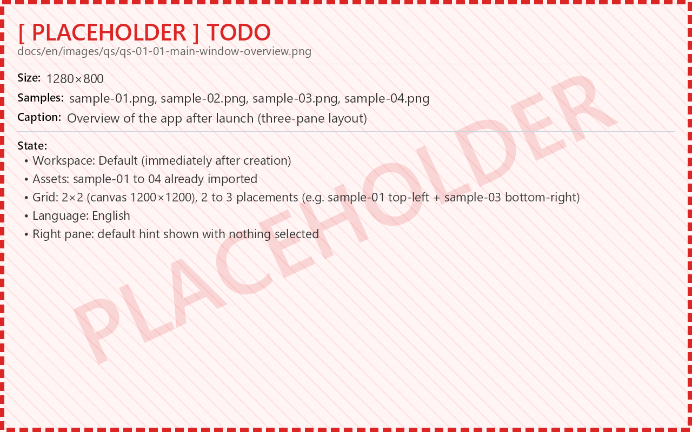

| 項目 | 内容 |
|---|---|
| File | `docs/en/images/qs/qs-01-01-main-window-overview.png` |
| Size | 1280×800 |
| Samples | sample-01.png, sample-02.png, sample-03.png, sample-04.png |
| Caption | Overview of the app after launch (three-pane layout) |
| Status | ✅ Replaced |
| Source | `quickstart.md:19` |

**State**:

- Workspace: Default (immediately after creation)
- Assets: sample-01 to 04 already imported
- Grid: 2×2 (canvas 1200×1200), 2 to 3 placements (e.g. sample-01 top-left + sample-03 bottom-right)
- Language: English
- Right pane: default hint shown with nothing selected

**Review checklist**:
- [ ] サイズ一致 (placeholder の Size と実画像の寸法)
- [ ] サンプル画像一致 (Samples 通りの画像が映っている)
- [ ] State 通りの構図
- [ ] 言語設定 en

---

### ✅ `qs-03-01-drag-drop-images.png`

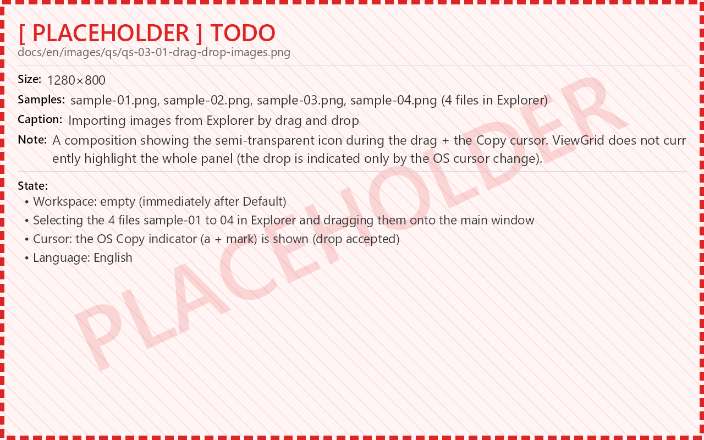

| 項目 | 内容 |
|---|---|
| File | `docs/en/images/qs/qs-03-01-drag-drop-images.png` |
| Size | 1280×800 |
| Samples | sample-01.png, sample-02.png, sample-03.png, sample-04.png (4 files in Explorer) |
| Caption | Importing images from Explorer by drag and drop |
| Note | A composition showing the semi-transparent icon during the drag + the Copy cursor. ViewGrid does not currently highlight the whole panel (the drop is indicated only by the OS cursor change). |
| Status | ✅ Replaced |
| Source | `quickstart.md:56` |

**State**:

- Workspace: empty (immediately after Default)
- Selecting the 4 files sample-01 to 04 in Explorer and dragging them onto the main window
- Cursor: the OS Copy indicator (a + mark) is shown (drop accepted)
- Language: English

**Review checklist**:
- [ ] サイズ一致 (placeholder の Size と実画像の寸法)
- [ ] サンプル画像一致 (Samples 通りの画像が映っている)
- [ ] State 通りの構図
- [ ] 言語設定 en

---

### ✅ `qs-03-02-create-grid-flyout.png`

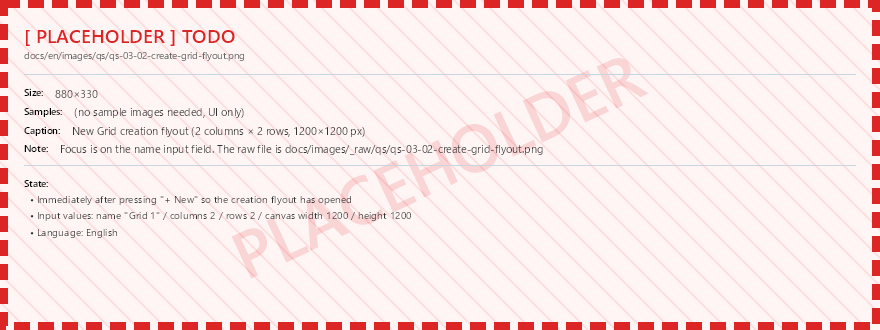

| 項目 | 内容 |
|---|---|
| File | `docs/en/images/qs/qs-03-02-create-grid-flyout.png` |
| Size | 880×330 |
| Samples | (no sample images needed, UI only) |
| Caption | New Grid creation flyout (2 columns × 2 rows, 1200×1200 px) |
| Note | Focus is on the name input field. The raw file is docs/images/_raw/qs/qs-03-02-create-grid-flyout.png |
| Status | ✅ Replaced |
| Source | `quickstart.md:77` |

**State**:

- Immediately after pressing "+ New" so the creation flyout has opened
- Input values: name "Grid 1" / columns 2 / rows 2 / canvas width 1200 / height 1200
- Language: English

**Review checklist**:
- [ ] サイズ一致 (placeholder の Size と実画像の寸法)
- [ ] サンプル画像一致 (Samples 通りの画像が映っている)
- [ ] State 通りの構図
- [ ] 言語設定 en

---

### ✅ `qs-03-03-drag-to-cell.png`

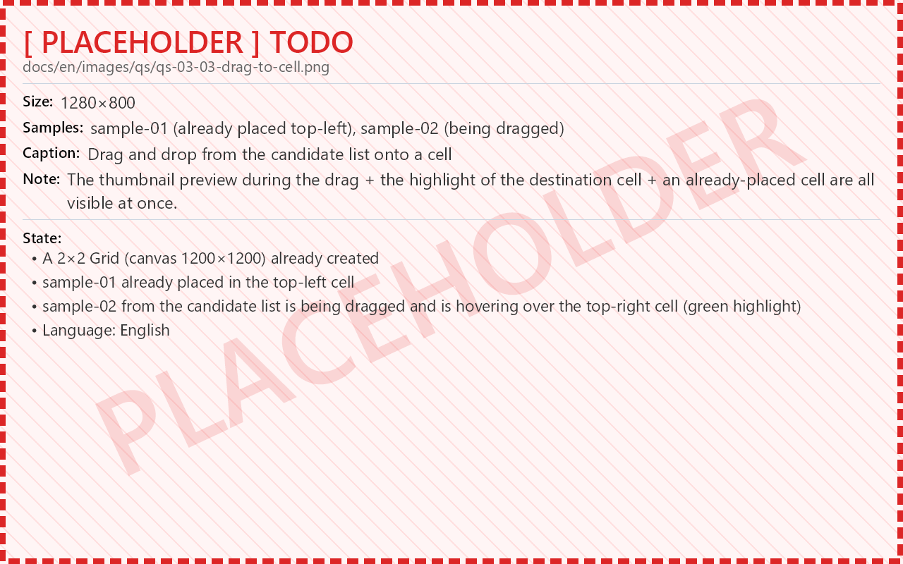

| 項目 | 内容 |
|---|---|
| File | `docs/en/images/qs/qs-03-03-drag-to-cell.png` |
| Size | 1280×800 |
| Samples | sample-01 (already placed top-left), sample-02 (being dragged) |
| Caption | Drag and drop from the candidate list onto a cell |
| Note | The thumbnail preview during the drag + the highlight of the destination cell + an already-placed cell are all visible at once. |
| Status | ✅ Replaced |
| Source | `quickstart.md:98` |

**State**:

- A 2×2 Grid (canvas 1200×1200) already created
- sample-01 already placed in the top-left cell
- sample-02 from the candidate list is being dragged and is hovering over the top-right cell (green highlight)
- Language: English

**Review checklist**:
- [ ] サイズ一致 (placeholder の Size と実画像の寸法)
- [ ] サンプル画像一致 (Samples 通りの画像が映っている)
- [ ] State 通りの構図
- [ ] 言語設定 en

---

### ✅ `qs-03-04-preview-window.png`

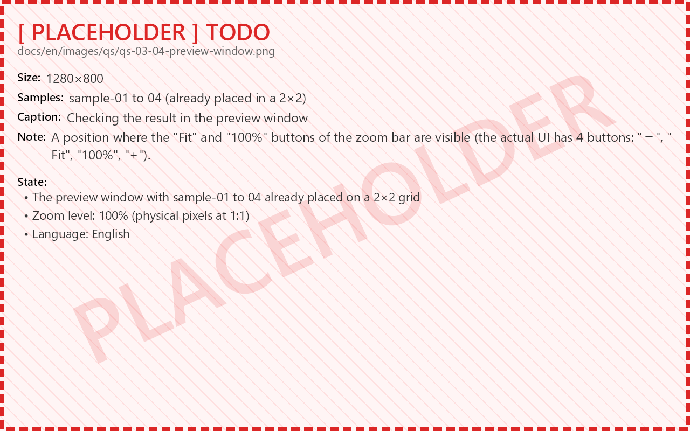

| 項目 | 内容 |
|---|---|
| File | `docs/en/images/qs/qs-03-04-preview-window.png` |
| Size | 1280×800 |
| Samples | sample-01 to 04 (already placed in a 2×2) |
| Caption | Checking the result in the preview window |
| Note | A position where the "Fit" and "100%" buttons of the zoom bar are visible (the actual UI has 4 buttons: "−", "Fit", "100%", "+"). |
| Status | ✅ Replaced |
| Source | `quickstart.md:119` |

**State**:

- The preview window with sample-01 to 04 already placed on a 2×2 grid
- Zoom level: 100% (physical pixels at 1:1)
- Language: English

**Review checklist**:
- [ ] サイズ一致 (placeholder の Size と実画像の寸法)
- [ ] サンプル画像一致 (Samples 通りの画像が映っている)
- [ ] State 通りの構図
- [ ] 言語設定 en

---

### ✅ `qs-03-05-export-png-dialog.png`

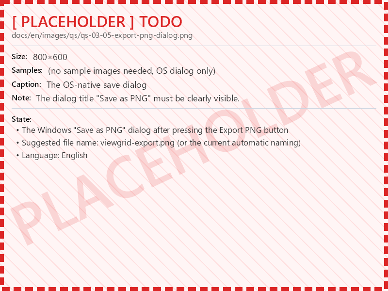

| 項目 | 内容 |
|---|---|
| File | `docs/en/images/qs/qs-03-05-export-png-dialog.png` |
| Size | 800×600 |
| Samples | (no sample images needed, OS dialog only) |
| Caption | The OS-native save dialog |
| Note | The dialog title "Save as PNG" must be clearly visible. |
| Status | ✅ Replaced |
| Source | `quickstart.md:135` |

**State**:

- The Windows "Save as PNG" dialog after pressing the Export PNG button
- Suggested file name: viewgrid-export.png (or the current automatic naming)
- Language: English

**Review checklist**:
- [ ] サイズ一致 (placeholder の Size と実画像の寸法)
- [ ] サンプル画像一致 (Samples 通りの画像が映っている)
- [ ] State 通りの構図
- [ ] 言語設定 en

---

## `user-manual/01-concepts.md`

### ✅ `um-01-03-main-window-3pane.png`

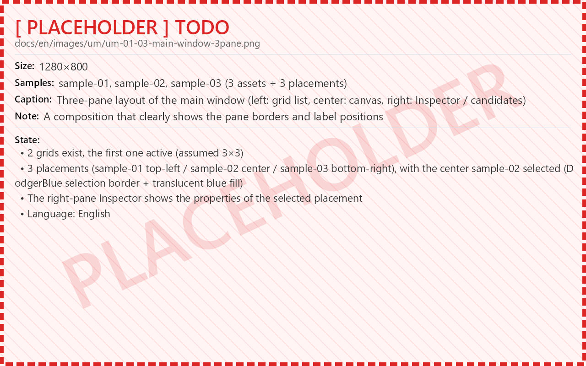

| 項目 | 内容 |
|---|---|
| File | `docs/en/images/um/um-01-03-main-window-3pane.png` |
| Size | 1280×800 |
| Samples | sample-01, sample-02, sample-03 (3 assets + 3 placements) |
| Caption | Three-pane layout of the main window (left: grid list, center: canvas, right: Inspector / candidates) |
| Note | A composition that clearly shows the pane borders and label positions |
| Status | ✅ Replaced |
| Source | `user-manual/01-concepts.md:78` |

**State**:

- 2 grids exist, the first one active (assumed 3×3)
- 3 placements (sample-01 top-left / sample-02 center / sample-03 bottom-right), with the center sample-02 selected (DodgerBlue selection border + translucent blue fill)
- The right-pane Inspector shows the properties of the selected placement
- Language: English

**Review checklist**:
- [ ] サイズ一致 (placeholder の Size と実画像の寸法)
- [ ] サンプル画像一致 (Samples 通りの画像が映っている)
- [ ] State 通りの構図
- [ ] 言語設定 en

---

## `user-manual/02-assets.md`

### ✅ `um-02-04-add-images-picker.png`

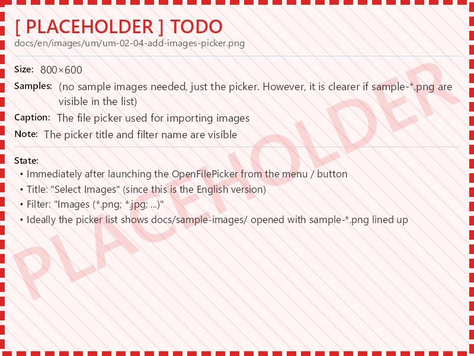

| 項目 | 内容 |
|---|---|
| File | `docs/en/images/um/um-02-04-add-images-picker.png` |
| Size | 800×600 |
| Samples | (no sample images needed, just the picker. However, it is clearer if sample-*.png are visible in the list) |
| Caption | The file picker used for importing images |
| Note | The picker title and filter name are visible |
| Status | ✅ Replaced |
| Source | `user-manual/02-assets.md:21` |

**State**:

- Immediately after launching the OpenFilePicker from the menu / button
- Title: "Select Images" (since this is the English version)
- Filter: "Images (*.png; *.jpg; ...)"
- Ideally the picker list shows docs/sample-images/ opened with sample-*.png lined up

**Review checklist**:
- [ ] サイズ一致 (placeholder の Size と実画像の寸法)
- [ ] サンプル画像一致 (Samples 通りの画像が映っている)
- [ ] State 通りの構図
- [ ] 言語設定 en

---

### ✅ `um-02-05-add-variant.png`

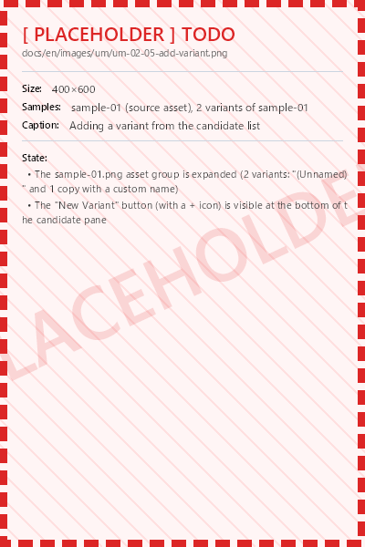

| 項目 | 内容 |
|---|---|
| File | `docs/en/images/um/um-02-05-add-variant.png` |
| Size | 400×600 |
| Samples | sample-01 (source asset), 2 variants of sample-01 |
| Caption | Adding a variant from the candidate list |
| Status | ✅ Replaced |
| Source | `user-manual/02-assets.md:68` |

**State**:

- The sample-01.png asset group is expanded (2 variants: "(Unnamed)" and 1 copy with a custom name)
- The "New Variant" button (with a + icon) is visible at the bottom of the candidate pane

**Review checklist**:
- [ ] サイズ一致 (placeholder の Size と実画像の寸法)
- [ ] サンプル画像一致 (Samples 通りの画像が映っている)
- [ ] State 通りの構図
- [ ] 言語設定 en

---

## `user-manual/03-grids.md`

### ✅ `um-03-06-create-grid-flyout.png`

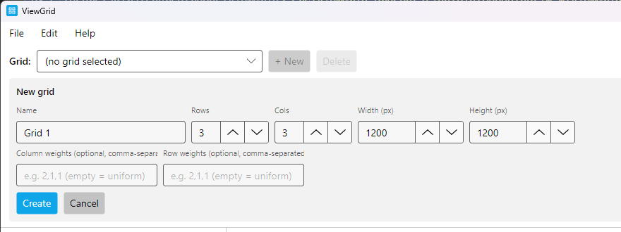

| 項目 | 内容 |
|---|---|
| File | `docs/en/images/um/um-03-06-create-grid-flyout.png` |
| Size | 880×330 |
| Samples | (no sample image needed, UI only) |
| Caption | New Grid creation flyout |
| Note | All fields and the Create / Cancel buttons are visible |
| Status | ✅ Replaced |
| Source | `user-manual/03-grids.md:20` |

**State**:

- Creation flyout expanded, defaults unchanged (Grid N / 3x3 / 1200x1200)
- Language: English

**Review checklist**:
- [ ] サイズ一致 (placeholder の Size と実画像の寸法)
- [ ] サンプル画像一致 (Samples 通りの画像が映っている)
- [ ] State 通りの構図
- [ ] 言語設定 en

---

### ✅ `um-03-06-grid-properties.png`

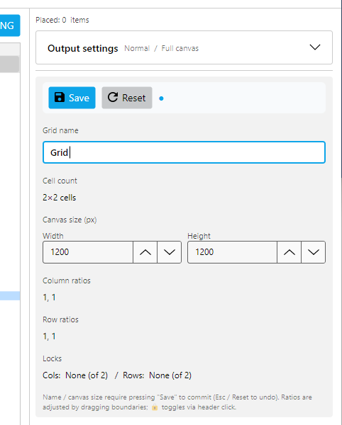

| 項目 | 内容 |
|---|---|
| File | `docs/en/images/um/um-03-06-grid-properties.png` |
| Size | 482×600 |
| Samples | (no sample image needed, Grid only selected) |
| Caption | Grid Settings in the right pane (draft editing + Save button) |
| Status | ✅ Replaced |
| Source | `user-manual/03-grids.md:38` |

**State**:

- Grid selected (whether or not it has Placements), Grid Settings shown in the right pane
- Name edited into a draft state (showing the bullet badge)

**Review checklist**:
- [ ] サイズ一致 (placeholder の Size と実画像の寸法)
- [ ] サンプル画像一致 (Samples 通りの画像が映っている)
- [ ] State 通りの構図
- [ ] 言語設定 en

---

### ✅ `um-03-07-boundary-drag.png`

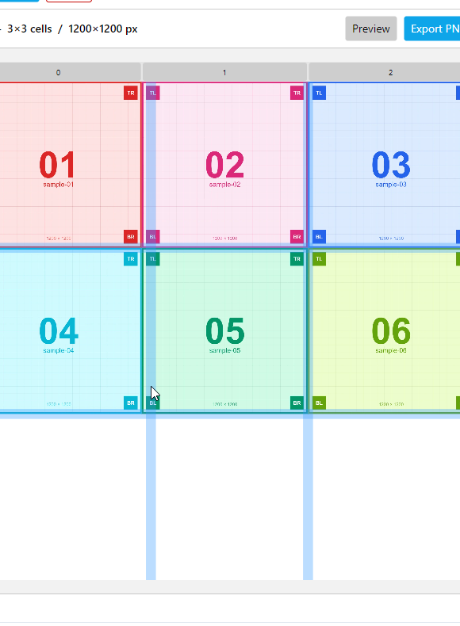

| 項目 | 内容 |
|---|---|
| File | `docs/en/images/um/um-03-07-boundary-drag.png` |
| Size | 580×790 |
| Samples | sample-01 through sample-06 (6 of the 9 cells in a 3x3 grid filled; the grid lines make boundary movement easy to see) |
| Caption | Adjusting column width by dragging a boundary |
| Status | ✅ Replaced |
| Source | `user-manual/03-grids.md:57` |

**State**:

- sample-01 through sample-06 placed in a 3x3 Grid (canvas around 1500x1500)
- The left boundary of the center column is being dragged, with the boundary line emphasized as a thicker line
- The grid lines on the sample images make the boundary movement readable to the pixel

**Review checklist**:
- [ ] サイズ一致 (placeholder の Size と実画像の寸法)
- [ ] サンプル画像一致 (Samples 通りの画像が映っている)
- [ ] State 通りの構図
- [ ] 言語設定 en

---

## `user-manual/04-placements.md`

### ✅ `um-04-09-drop-valid.png`

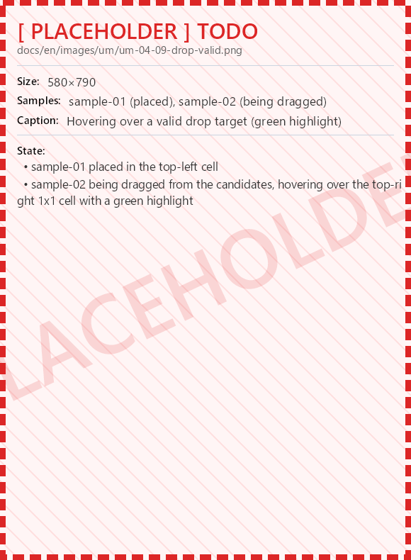

| 項目 | 内容 |
|---|---|
| File | `docs/en/images/um/um-04-09-drop-valid.png` |
| Size | 580×790 |
| Samples | sample-01 (placed), sample-02 (being dragged) |
| Caption | Hovering over a valid drop target (green highlight) |
| Status | ✅ Replaced |
| Source | `user-manual/04-placements.md:15` |

**State**:

- sample-01 placed in the top-left cell
- sample-02 being dragged from the candidates, hovering over the top-right 1x1 cell with a green highlight

**Review checklist**:
- [ ] サイズ一致 (placeholder の Size と実画像の寸法)
- [ ] サンプル画像一致 (Samples 通りの画像が映っている)
- [ ] State 通りの構図
- [ ] 言語設定 en

---

### ✅ `um-04-10-inspector.png`

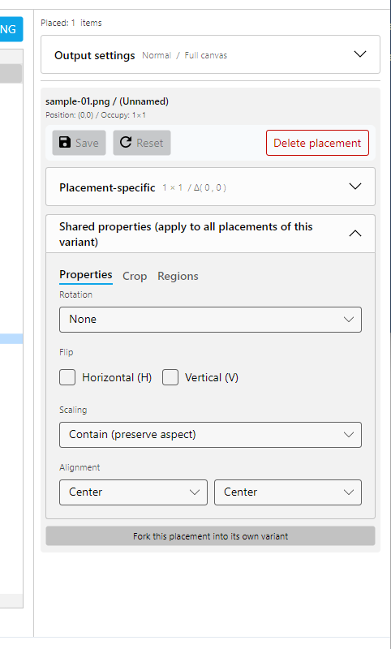

| 項目 | 内容 |
|---|---|
| File | `docs/en/images/um/um-04-10-inspector.png` |
| Size | 482×800 |
| Samples | sample-01 (placed and selected) |
| Caption | Structure of the Inspector (placement-specific + shared properties, with the save bar + Delete Placement at the top) |
| Status | ✅ Replaced |
| Source | `user-manual/04-placements.md:47` |

**State**:

- sample-01 placed and selected, Inspector shown
- "Placement-Specific" Expander expanded (occupied cells + pixel offset)
- "Shared Properties" Expander collapsed (same collapse pattern as the output settings)

**Review checklist**:
- [ ] サイズ一致 (placeholder の Size と実画像の寸法)
- [ ] サンプル画像一致 (Samples 通りの画像が映っている)
- [ ] State 通りの構図
- [ ] 言語設定 en

---

## `user-manual/05-shared-properties.md`

### ✅ `um-05-11-scaling-modes.png`

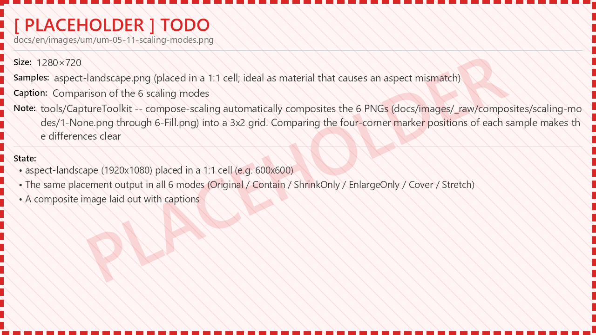

| 項目 | 内容 |
|---|---|
| File | `docs/en/images/um/um-05-11-scaling-modes.png` |
| Size | 1280×720 |
| Samples | aspect-landscape.png (placed in a 1:1 cell; ideal as material that causes an aspect mismatch) |
| Caption | Comparison of the 6 scaling modes |
| Note | tools/CaptureToolkit -- compose-scaling automatically composites the 6 PNGs (docs/images/_raw/composites/scaling-modes/1-None.png through 6-Fill.png) into a 3x2 grid. Comparing the four-corner marker positions of each sample makes the differences clear |
| Status | ✅ Replaced |
| Source | `user-manual/05-shared-properties.md:61` |

**State**:

- aspect-landscape (1920x1080) placed in a 1:1 cell (e.g. 600x600)
- The same placement output in all 6 modes (Original / Contain / ShrinkOnly / EnlargeOnly / Cover / Stretch)
- A composite image laid out with captions

**Review checklist**:
- [ ] サイズ一致 (placeholder の Size と実画像の寸法)
- [ ] サンプル画像一致 (Samples 通りの画像が映っている)
- [ ] State 通りの構図
- [ ] 言語設定 en

---

### ✅ `um-05-11-alignment.png`

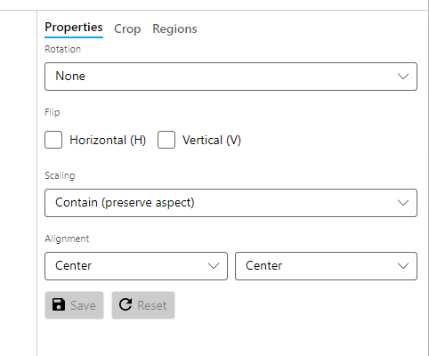

| 項目 | 内容 |
|---|---|
| File | `docs/en/images/um/um-05-11-alignment.png` |
| Size | 482×400 |
| Samples | (no sample image needed, UI only) |
| Caption | Structure of the shared properties editing tab (Properties) |
| Note | In the implementation, alignment is two ComboBoxes (AlignX / AlignY). The "3x3 radio buttons + arrow icons" that the spec envisioned is not implemented (a candidate for a future UI improvement) |
| Status | ✅ Replaced |
| Source | `user-manual/05-shared-properties.md:94` |

**State**:

- A Variant selected in the candidate list (the Properties tab is open in the right pane)
- Contents of the Properties tab: Rotation (None) / Flip (horizontal / vertical) / Scaling (Maintain aspect ratio (contain)) / Alignment X+Y (both Center)
- Save / Reset buttons at the bottom (grayed out = no edits)

**Review checklist**:
- [ ] サイズ一致 (placeholder の Size と実画像の寸法)
- [ ] サンプル画像一致 (Samples 通りの画像が映っている)
- [ ] State 通りの構図
- [ ] 言語設定 en

---

### ✅ `um-05-13-autocrop.png`

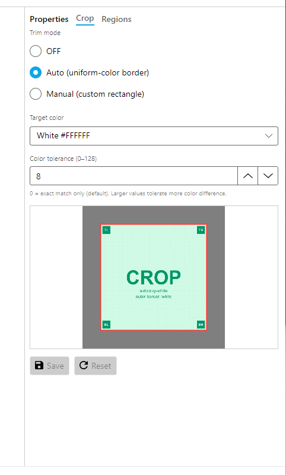

| 項目 | 内容 |
|---|---|
| File | `docs/en/images/um/um-05-13-autocrop.png` |
| Size | 482×800 |
| Samples | autocrop-white.png (200px white margin on the outer edge + a 1200x1200 subject inside) |
| Caption | AutoCrop settings + the detected rectangle on the preview thumbnail |
| Note | If taking 3 shots to compare the white / black / transparent presets, use autocrop-black/transparent with the same composition |
| Status | ✅ Replaced |
| Source | `user-manual/05-shared-properties.md:178` |

**State**:

- The Variant for autocrop-white.png is selected
- Cropping: "Automatic (solid-color margin)" selected
- Target color: white #FFFFFF
- Color tolerance slider value around 16
- The detected crop rectangle (the 1200x1200 portion) shown as a dotted line on the preview thumbnail

**Review checklist**:
- [ ] サイズ一致 (placeholder の Size と実画像の寸法)
- [ ] サンプル画像一致 (Samples 通りの画像が映っている)
- [ ] State 通りの構図
- [ ] 言語設定 en

---

### ✅ `um-05-13-manualcrop-editor.png`

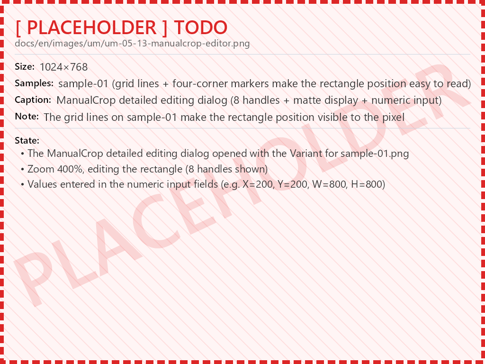

| 項目 | 内容 |
|---|---|
| File | `docs/en/images/um/um-05-13-manualcrop-editor.png` |
| Size | 1024×768 |
| Samples | sample-01 (grid lines + four-corner markers make the rectangle position easy to read) |
| Caption | ManualCrop detailed editing dialog (8 handles + matte display + numeric input) |
| Note | The grid lines on sample-01 make the rectangle position visible to the pixel |
| Status | ✅ Replaced |
| Source | `user-manual/05-shared-properties.md:211` |

**State**:

- The ManualCrop detailed editing dialog opened with the Variant for sample-01.png
- Zoom 400%, editing the rectangle (8 handles shown)
- Values entered in the numeric input fields (e.g. X=200, Y=200, W=800, H=800)

**Review checklist**:
- [ ] サイズ一致 (placeholder の Size と実画像の寸法)
- [ ] サンプル画像一致 (Samples 通りの画像が映っている)
- [ ] State 通りの構図
- [ ] 言語設定 en

---

### ✅ `um-05-14-region-tab.png`

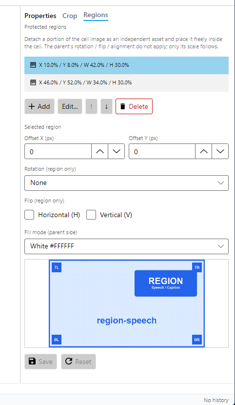

| 項目 | 内容 |
|---|---|
| File | `docs/en/images/um/um-05-14-region-tab.png` |
| Size | 482×830 |
| Samples | region-speech.png (a source image where a speech-bubble-style region is easy to understand) |
| Caption | Structure of the Protected Regions tab (list + detailed editing of the selected region) |
| Status | ✅ Replaced |
| Source | `user-manual/05-shared-properties.md:246` |

**State**:

- The Variant for region-speech.png is selected, the Protected Regions tab expanded
- 2 regions registered (1st: a region matching the speech-bubble area; 2nd: a different area)
- The 1st region selected, showing the detailed editing panel (Offset / Rotation / Flip / FillMode)

**Review checklist**:
- [ ] サイズ一致 (placeholder の Size と実画像の寸法)
- [ ] サンプル画像一致 (Samples 通りの画像が映っている)
- [ ] State 通りの構図
- [ ] 言語設定 en

---

## `user-manual/06-output.md`

### ✅ `um-06-15-output-settings.png`

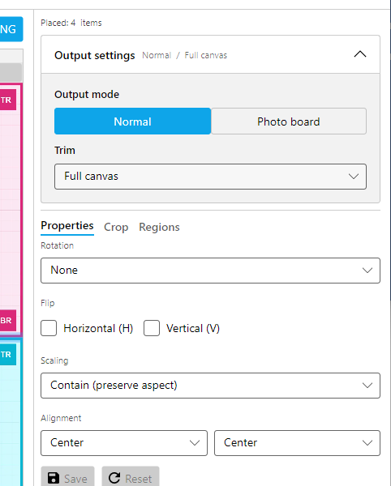

| 項目 | 内容 |
|---|---|
| File | `docs/en/images/um/um-06-15-output-settings.png` |
| Size | 482×600 |
| Samples | sample-01 to 04 (placed in a 2x2 layout, partly visible in the background) |
| Caption | Expanded state of the Output Settings (mode / style / intensity / trim) |
| Status | ✅ Replaced |
| Source | `user-manual/06-output.md:16` |

**State**:

- sample-01 to 04 placed in a 2x2 grid
- Output Settings expander in the right pane is expanded, Normal mode / Full trim
- If a separate shot of the collapsed header summary "Normal / Full" is available, add it too

**Review checklist**:
- [ ] サイズ一致 (placeholder の Size と実画像の寸法)
- [ ] サンプル画像一致 (Samples 通りの画像が映っている)
- [ ] State 通りの構図
- [ ] 言語設定 en

---

### ✅ `um-06-16-photoboard-styles.png`

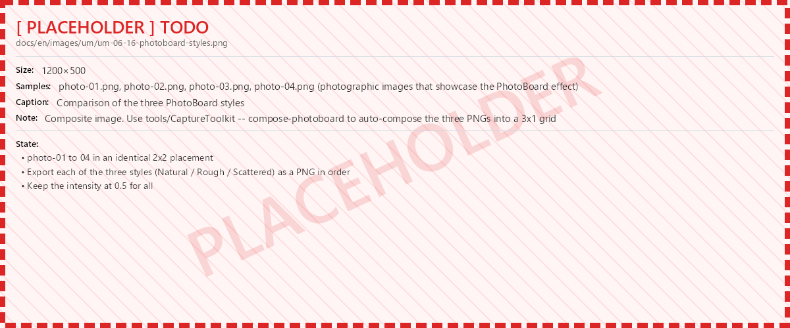

| 項目 | 内容 |
|---|---|
| File | `docs/en/images/um/um-06-16-photoboard-styles.png` |
| Size | 1200×500 |
| Samples | photo-01.png, photo-02.png, photo-03.png, photo-04.png (photographic images that showcase the PhotoBoard effect) |
| Caption | Comparison of the three PhotoBoard styles |
| Note | Composite image. Use tools/CaptureToolkit -- compose-photoboard to auto-compose the three PNGs into a 3x1 grid |
| Status | ✅ Replaced |
| Source | `user-manual/06-output.md:73` |

**State**:

- photo-01 to 04 in an identical 2x2 placement
- Export each of the three styles (Natural / Rough / Scattered) as a PNG in order
- Keep the intensity at 0.5 for all

**Review checklist**:
- [ ] サイズ一致 (placeholder の Size と実画像の寸法)
- [ ] サンプル画像一致 (Samples 通りの画像が映っている)
- [ ] State 通りの構図
- [ ] 言語設定 en

---

### ✅ `um-06-18-preview.png`

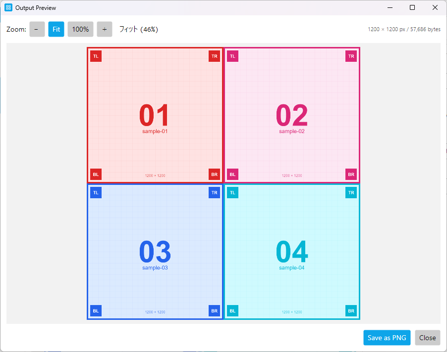

| 項目 | 内容 |
|---|---|
| File | `docs/en/images/um/um-06-18-preview.png` |
| Size | 1280×900 |
| Samples | sample-01 to 04 (2x2 placement) |
| Caption | Layout of the preview window |
| Status | ✅ Replaced |
| Source | `user-manual/06-output.md:129` |

**State**:

- Preview of a grid with sample-01 to 04 placed in a 2x2 layout, zoom at 100%
- The zoom bar (- / Fit / 100% / + / magnification display) is visible

**Review checklist**:
- [ ] サイズ一致 (placeholder の Size と実画像の寸法)
- [ ] サンプル画像一致 (Samples 通りの画像が映っている)
- [ ] State 通りの構図
- [ ] 言語設定 en

---

## `user-manual/07-workspaces.md`

### ✅ `um-07-21-workspace-switch.png`

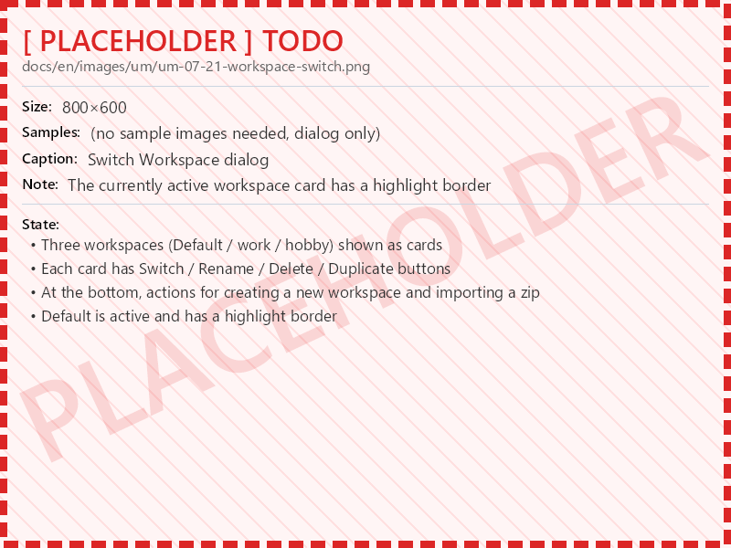

| 項目 | 内容 |
|---|---|
| File | `docs/en/images/um/um-07-21-workspace-switch.png` |
| Size | 800×600 |
| Samples | (no sample images needed, dialog only) |
| Caption | Switch Workspace dialog |
| Note | The currently active workspace card has a highlight border |
| Status | ✅ Replaced |
| Source | `user-manual/07-workspaces.md:58` |

**State**:

- Three workspaces (Default / work / hobby) shown as cards
- Each card has Switch / Rename / Delete / Duplicate buttons
- At the bottom, actions for creating a new workspace and importing a zip
- Default is active and has a highlight border

**Review checklist**:
- [ ] サイズ一致 (placeholder の Size と実画像の寸法)
- [ ] サンプル画像一致 (Samples 通りの画像が映っている)
- [ ] State 通りの構図
- [ ] 言語設定 en

---

## `user-manual/08-history.md`

### ✅ `um-08-25-history-flyout.png`

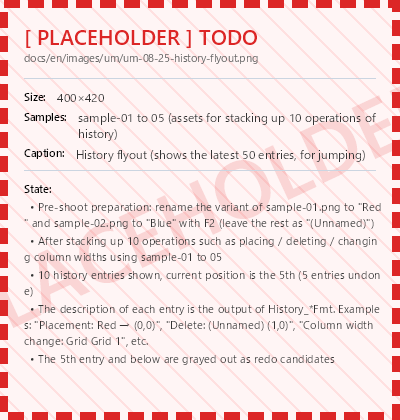

| 項目 | 内容 |
|---|---|
| File | `docs/en/images/um/um-08-25-history-flyout.png` |
| Size | 400×420 |
| Samples | sample-01 to 05 (assets for stacking up 10 operations of history) |
| Caption | History flyout (shows the latest 50 entries, for jumping) |
| Status | ✅ Replaced |
| Source | `user-manual/08-history.md:41` |

**State**:

- Pre-shoot preparation: rename the variant of sample-01.png to "Red" and sample-02.png to "Blue" with F2 (leave the rest as "(Unnamed)")
- After stacking up 10 operations such as placing / deleting / changing column widths using sample-01 to 05
- 10 history entries shown, current position is the 5th (5 entries undone)
- The description of each entry is the output of History_*Fmt. Examples: "Placement: Red → (0,0)", "Delete: (Unnamed) (1,0)", "Column width change: Grid Grid 1", etc.
- The 5th entry and below are grayed out as redo candidates

**Review checklist**:
- [ ] サイズ一致 (placeholder の Size と実画像の寸法)
- [ ] サンプル画像一致 (Samples 通りの画像が映っている)
- [ ] State 通りの構図
- [ ] 言語設定 en

---

## `user-manual/09-settings.md`

### ✅ `um-09-26-settings-dialog.png`

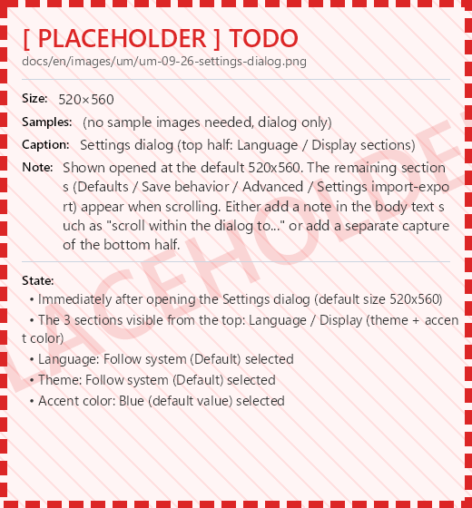

| 項目 | 内容 |
|---|---|
| File | `docs/en/images/um/um-09-26-settings-dialog.png` |
| Size | 520×560 |
| Samples | (no sample images needed, dialog only) |
| Caption | Settings dialog (top half: Language / Display sections) |
| Note | Shown opened at the default 520x560. The remaining sections (Defaults / Save behavior / Advanced / Settings import-export) appear when scrolling. Either add a note in the body text such as "scroll within the dialog to..." or add a separate capture of the bottom half. |
| Status | ✅ Replaced |
| Source | `user-manual/09-settings.md:18` |

**State**:

- Immediately after opening the Settings dialog (default size 520x560)
- The 3 sections visible from the top: Language / Display (theme + accent color)
- Language: Follow system (Default) selected
- Theme: Follow system (Default) selected
- Accent color: Blue (default value) selected

**Review checklist**:
- [ ] サイズ一致 (placeholder の Size と実画像の寸法)
- [ ] サンプル画像一致 (Samples 通りの画像が映っている)
- [ ] State 通りの構図
- [ ] 言語設定 en

---

