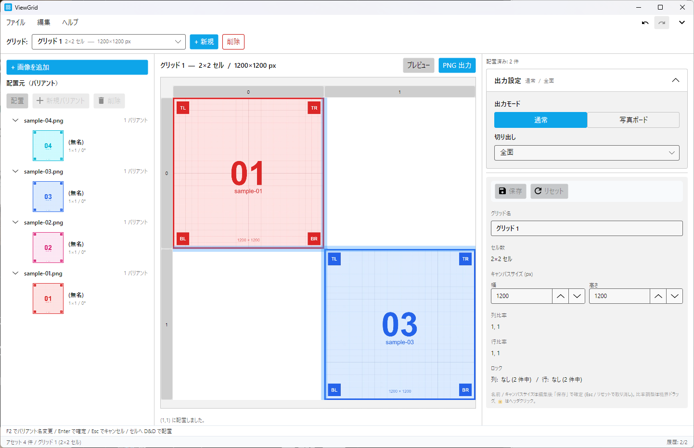
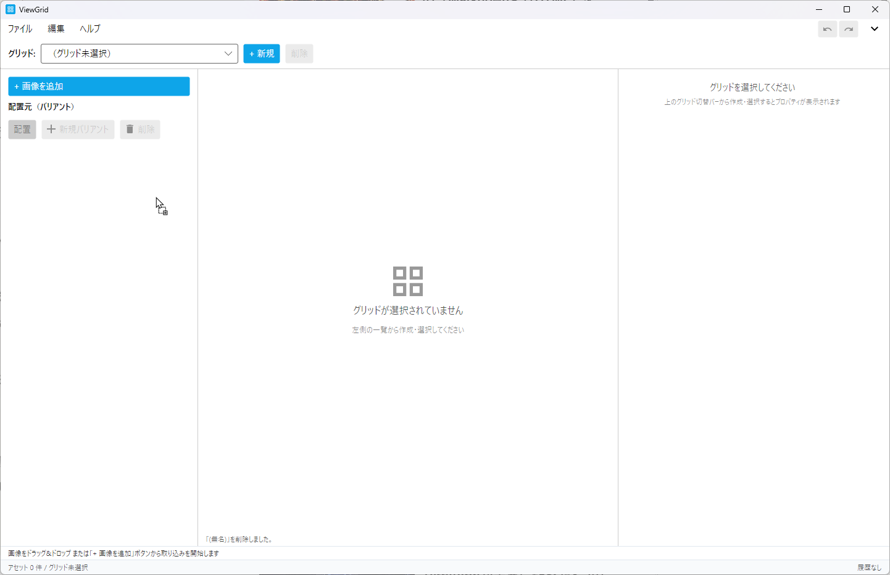
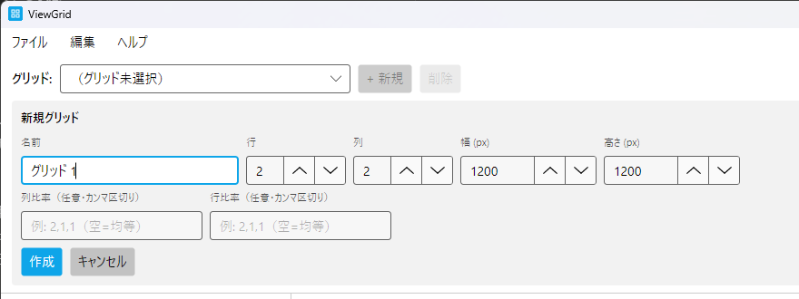
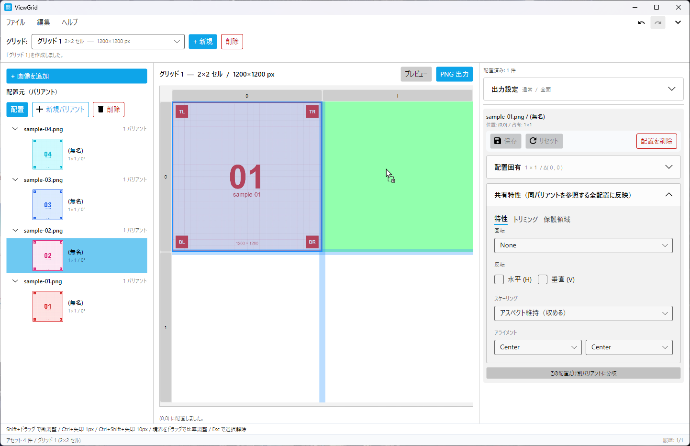
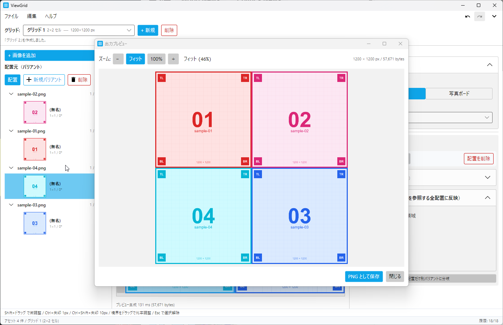
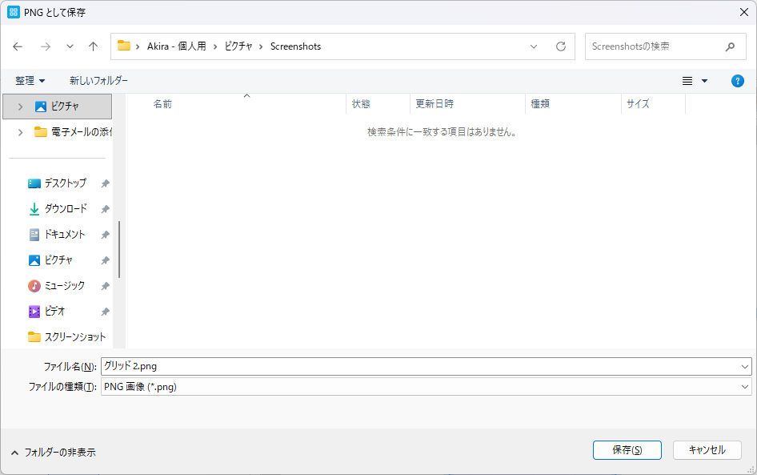

# ViewGrid クイックスタート

このガイドは ViewGrid を初めて使う方が、 **5〜10 分で最初の連結画像を PNG として出力できる** ようになるための最短経路を案内します。 概念の詳細や個別機能の説明は省略しています。 細かい挙動を知りたいときは [ユーザーマニュアル](user-manual/README.md) を参照してください。

---

## 1. ViewGrid とは

ViewGrid は、 複数の画像をグリッド (NxM のマス目) に配置して 1 枚の連結画像 (PNG) として出力するデスクトップアプリです。

主な用途:

- 商品カタログ / SNS 投稿用の比較画像 (Before / After 等)
- 写真ボード風の合成画像
- 任意の N×M グリッド + キャンバスサイズで配置

<!-- CAPTURE
file: docs/images/qs/qs-01-01-main-window-overview.png
size: 1280x800
samples: sample-01.png, sample-02.png, sample-03.png, sample-04.png
state:
  - ワークスペース: Default (新規作成直後)
  - アセット: sample-01〜04 を取り込み済み
  - グリッド: 2×2 (キャンバス 1200×1200)、 配置 2 〜 3 件 (sample-01 を左上 + sample-03 を右下 等)
  - 言語: 日本語
  - 右ペイン: 何も選択していないデフォルト Hint 表示
caption: アプリ起動後の全体像 (3 ペイン構成)
-->

---

## 2. インストールと起動

ViewGrid は **単一の実行ファイル (`ViewGrid.Presentation.exe`) を直接起動** するだけで動きます。 別途 .NET ランタイムをインストールする必要はありません。

1. 配布された exe を任意のフォルダに置く (例: `C:\Apps\ViewGrid\`)
2. exe をダブルクリックして起動
3. 初回起動時に `%LocalAppData%\ViewGrid\` にデータフォルダが自動作成されます (画像本体 / サムネ / DB / ログ / 設定の保存先)

> **初回起動でしばらく待つ場合があります**: 単一 exe は内部でランタイムを展開する仕組みのため、 初回だけ数秒のオーバーヘッドがあります。 2 回目以降は即起動します。

---

## 3. 5 分チュートリアル: 最初の 1 枚を出力する

このセクションで作るもの: **2×2 のグリッドに 4 枚の画像を並べて 1 枚の PNG にする**。

### 3-1. 画像を取り込む

メインウィンドウ右ペインに画像をドラッグ&ドロップするか、 メニューの **ファイル → 画像を追加...** で取り込みます。

<!-- CAPTURE
file: docs/images/qs/qs-03-01-drag-drop-images.png
size: 1280x800
samples: sample-01.png, sample-02.png, sample-03.png, sample-04.png (エクスプローラ上の 4 ファイル)
state:
  - ワークスペース: 空 (Default 直後)
  - エクスプローラから sample-01〜04 の 4 枚を選択してメインウィンドウへドラッグ中
  - カーソル: OS の Copy インジケータ (+ マーク) が表示されている (受入可)
  - 言語: 日本語
caption: 画像をエクスプローラからドラッグ&ドロップで取り込む
note: ドラッグ中の半透明アイコン + Copy カーソルが見える構図。 ViewGrid 側はパネル全体のハイライトは現状未実装 (OS カーソル変化のみで判別)
-->

取り込んだ画像は **候補リスト** (右ペイン) に **バリアント** (画像の論理コピー) として並びます。

### 3-2. グリッドを作成する

左ペイン上の **「+ 新規」** ボタンをクリックします。 名前 / 列数 / 行数 / キャンバスサイズの入力欄が現れます。

<!-- CAPTURE
file: docs/images/qs/qs-03-02-create-grid-flyout.png
size: 880x330 (左ペイン拡大、 タイトル + メニュー + グリッドツールバー + フライアウト全体)
crop: 0,0,880,330
samples: (サンプル画像不要、 UI のみ)
state:
  - 「+ 新規」 を押して作成フライアウトが開いた直後
  - 入力値: 名前 「グリッド 1」 / 列 2 / 行 2 / キャンバス幅 1200 / 高さ 1200
  - 言語: 日本語
caption: 新規グリッド作成フライアウト (列 2 × 行 2、 1200×1200 px)
note: フォーカスは名前入力欄に当たっている状態。 raw は docs/images/_raw/qs/qs-03-02-create-grid-flyout.png
-->

入力したら **作成** ボタンを押します。 中央のキャンバスエリアに 2×2 のグリッドが表示されます。

### 3-3. 画像をセルへドラッグして配置する

右ペインの候補リストから、 画像のサムネをグリッドのセルへドラッグ&ドロップします。 4 枚を左上 → 右上 → 左下 → 右下 の順に配置していきます。

<!-- CAPTURE
file: docs/images/qs/qs-03-03-drag-to-cell.png
size: 1280x800
samples: sample-01 (左上配置済み), sample-02 (ドラッグ中)
state:
  - グリッド 2×2 (キャンバス 1200×1200) 作成済み
  - 左上セルに sample-01 配置済み
  - 候補リストの sample-02 をドラッグ中で、 右上セルにホバー (緑のハイライト)
  - 言語: 日本語
caption: 候補からセルへドラッグ&ドロップ
note: ドラッグ中のサムネプレビュー + 配置先セルのハイライト + 配置済みセルが同時に見える
-->

配置済みのセルは画像で埋まり、 ステータスバーに 「配置しました」 のメッセージが出ます。

### 3-4. プレビューと PNG 出力

ヘッダ右の **プレビュー** ボタンで仕上がりを確認できます。

<!-- CAPTURE
file: docs/images/qs/qs-03-04-preview-window.png
size: 1280x800 (プレビューウィンドウ + 親ウィンドウが両方見える)
samples: sample-01〜04 (2×2 配置済み)
state:
  - sample-01〜04 を 2×2 グリッドに配置済みのプレビューウィンドウ
  - 拡大率: 100% (物理ピクセル等倍)
  - 言語: 日本語
caption: プレビューウィンドウで仕上がりを確認
note: ズームバーの 「フィット」 「100%」 ボタンが見える位置 (実 UI は 「−」 「フィット」 「100%」 「＋」 の 4 つ)
-->

問題なければ **Export PNG** ボタン (またはメニュー **ファイル → 出力** / `Ctrl+E`) で PNG として保存します。 保存ダイアログでファイル名を指定して完了です。

<!-- CAPTURE
file: docs/images/qs/qs-03-05-export-png-dialog.png
size: 実サイズ (OS ネイティブダイアログ全体)
samples: (サンプル画像不要、 OS ダイアログのみ)
state:
  - Export PNG ボタン押下後の Windows の 「PNG として保存」 ダイアログ
  - ファイル名候補: viewgrid-export.png (または現状の自動命名)
  - 言語: 日本語
caption: OS ネイティブの保存ダイアログ
note: ダイアログタイトル 「PNG として保存」 が確実に見える
-->

これで最初の 1 枚が完成しました。

---

## 4. これだけ覚えればすぐ使える

頻繁に使う操作を 1 ページにまとめました。

### キーボードショートカット (最頻出)

| 操作 | ショートカット |
|---|---|
| 画像を追加 | `Ctrl+O` |
| 新規グリッド作成 | `Ctrl+N` |
| PNG として出力 | `Ctrl+E` |
| 元に戻す (Undo) | `Ctrl+Z` |
| やり直し (Redo) | `Ctrl+Y` |
| 配置選択解除 | `Esc` |

### マウス操作

| 操作 | やり方 |
|---|---|
| 列幅 / 行高 を変更 | グリッドの境界線をドラッグ |
| 配置のピクセル微調整 | `Shift` + 配置をドラッグ |
| 配置を別セルへ移動 | 配置済みセルを別セルにドラッグ |
| 配置済み同士を入れ替え | 別の配置済みセル上にドロップ |
| 候補のバリアント名変更 | バリアントを選択 → `F2` |

### スケーリングモードの早見表

セル枠と画像の縦横比が違うときの挙動を決めます (右ペイン → スケーリング)。

| モード | 挙動 |
|---|---|
| 原寸固定 | 画像を元のピクセルサイズで配置 (はみ出しはセル境界でクリップ) |
| アスペクト維持 (収める) | アスペクト比を保ったままセルに収まるサイズに |
| アスペクト維持 (覆う・切り取り) | アスペクト比を保ったままセルを完全に埋め、 はみ出し分はクリップ |
| 完全充填 (縦横独立) | 縦横を独立に伸縮させてセルにピッタリ合わせる (アスペクト崩れる) |

---

## 5. 次のステップ

ここから先の機能はユーザーマニュアルで詳しく解説しています。 やりたいことから探してください。

| やりたいこと | 参照先 |
|---|---|
| 画像の余白を自動で切り抜きたい | [ユーザーマニュアル §5.13 トリミング (AutoCrop)](user-manual/05-shared-properties.md) |
| 任意の矩形でトリミングしたい | [ユーザーマニュアル §5.13 トリミング (ManualCrop)](user-manual/05-shared-properties.md) |
| 写真ボード風 (フレーム + 影 + 傾き) に出力したい | [ユーザーマニュアル §6.16 PhotoBoard 詳細](user-manual/06-output.md) |
| 画像の一部だけ別画像として浮かせたい (保護領域) | [ユーザーマニュアル §5.14 保護領域](user-manual/05-shared-properties.md) |
| 複数のワークスペースを使い分けたい | [ユーザーマニュアル §7 ワークスペース](user-manual/07-workspaces.md) |
| 過去の操作を取り消したい | [ユーザーマニュアル §8 操作履歴](user-manual/08-history.md) |
| 言語 / テーマ / アクセント色を変えたい | [ユーザーマニュアル §9 設定](user-manual/09-settings.md) |
| キーボードショートカット一覧を見たい | [ユーザーマニュアル §10.26 キーボードショートカット](user-manual/10-reference.md) |

不明な用語があれば [ユーザーマニュアル §10.30 用語集](user-manual/10-reference.md) も参考にしてください。
