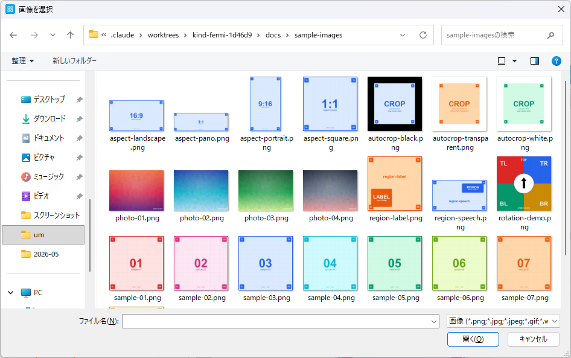
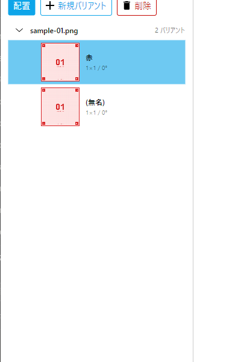

# §2 アセット管理

画像の取り込みと、 取り込んだ画像から派生する **バリアント (論理コピー)** の管理を解説します。

## 2.4 画像の取り込み

### 2.4.1 対応形式

PNG / JPEG / GIF / WebP / BMP。 半透明 (RGBA) は PNG と WebP のみ正しく扱えます。 GIF はアニメーション非対応 (最初のフレームのみ)。

### 2.4.2 取り込み方法

**方法 A: ドラッグ&ドロップ**
エクスプローラからメインウィンドウ上に複数選択してドロップ。

**方法 B: メニュー / ボタン**
**ファイル → 画像を追加...** または、 右ペイン上の **+ 画像を追加** ボタン (`Ctrl+O`)。 OS ネイティブのファイルピッカーが開きます。



<!-- CAPTURE
file: docs/images/um/um-02-04-add-images-picker.png
size: ピッカー実サイズ + 周辺余白
samples: (サンプル画像不要、 ピッカーのみ。 ただしリストに sample-*.png が見えていると分かりやすい)
state:
  - メニュー / ボタンから OpenFilePicker を起動した直後
  - タイトル: 「画像を選択」 (日本語版なので)
  - フィルタ: 「画像 (*.png; *.jpg; ...)」
  - ピッカーの一覧に docs/sample-images/ を開いて sample-*.png が並んだ状態が望ましい
caption: 画像取り込み用のファイルピッカー
note: ピッカーのタイトルとフィルタ名が見える
-->

### 2.4.3 取り込み後の挙動

1. 画像本体は `%LocalAppData%\ViewGrid\workspaces\<name>\images\<hash[0..1]>\<hash>.{ext}` にコピーされます (元ファイルは触らない)
2. サムネが `thumbnails\<hash[0..1]>\<hash>.webp` に自動生成されます
3. アセットごとに **既定バリアントが 1 件自動作成** されます (候補リストに即座に出現)

#### ハッシュベースの重複検出

ViewGrid は画像本体の **SHA256 ハッシュ** をファイル名に使うため、 **同じバイト列の画像は同一アセットとして扱われます**。 つまり:

- 同じ画像を 2 回取り込んでも DB / ディスク上の実体は 1 つだけ (アセットも 1 件)
- ファイル名が違っても中身が同じなら重複扱い (`photo.jpg` と `photo-copy.jpg` が同じバイト列なら同一)
- 中身が 1 byte でも違えば別アセット

#### ストレージ構造の利点

- ハッシュの先頭 2 桁でサブフォルダに分散 (`images\3a\3a5c8e...png`) — Windows エクスプローラの 1 フォルダ多ファイル問題を回避
- バックアップ時の整合性: DB と画像の対応はハッシュで一意なので、 ファイル単位のコピーで壊れない
- 完全削除: アセット削除時はバリアント / 配置を cascade 削除 + ディスクから画像本体も削除

## 2.5 バリアント (論理コピー)

### 2.5.1 バリアントとは

同じアセットを、 別のトリミング / 回転 / スケーリング設定で使いたいときに作る 「設定違いの分身」。 配置時にどのバリアントを使うかを選びます。

例: 同じ風景写真を **(A) 縦長クロップで人物にフォーカス** / **(B) 横長クロップで全景** の 2 バリアントとして登録すると、 同じグリッド内で別々に使えます。

### 2.5.2 新規バリアント作成

候補リストでアセットを選び **「新規バリアント」** ボタン (+ アイコン付き)。 既存バリアントを複製してから編集する流れが多い。



<!-- CAPTURE
file: docs/images/um/um-02-05-add-variant.png
size: 400x600 (候補ペインのクロップ、 ボタン群と展開済みバリアントが両方見える)
crop: 0,200,400,600
samples: sample-01 (アセット元)、 sample-01 のバリアント 2 件
state:
  - sample-01.png のアセットグループを展開済み (バリアント 2 件: 「(無名)」 と任意名のコピー 1 件)
  - 候補ペイン下部に「新規バリアント」 ボタン (+ アイコン付き) が見える
caption: 候補リストからバリアントを追加
-->

### 2.5.3 バリアント分岐 (Fork)

既に配置済みのバリアントに対して 「この配置だけ別バリアントにしたい」 場合、 Inspector の **この配置だけ別バリアントに分岐** ボタンで現バリアントを複製した独立バリアントへ切り替えできます。

→ §4.10 [配置 Inspector の Fork](04-placements.md)

### 2.5.4 バリアント名変更

候補リストでバリアントを選択 → `F2` でインラインリネーム。 `Enter` で確定、 `Esc` でキャンセル。

### 2.5.5 バリアント削除

候補リストでバリアントを選び **削除** ボタン。 そのバリアントを参照する配置も cascade で消えます (確認ダイアログ表示)。

## 2.6 候補リストの構造

候補リストは **アセット単位でグループ化** されています。

```
📁 photo-001.jpg (アセット名)
   ├─ バリアント 1   (3°回転 / クロップ A)
   └─ バリアント 2   (元のまま)
📁 photo-002.jpg
   └─ バリアント 1
```

- アセット行をクリック → 全バリアントを展開 / 折りたたみ
- バリアント行をクリック → そのバリアントの **共有特性編集タブ** が右ペインに開く
- バリアントをセルへドラッグ → 配置作成

→ §4 [配置](04-placements.md) で配置方法を詳述

### 2.6.1 グループの展開状態の永続化

各アセットグループの展開 / 折りたたみ状態は **セッション内** で保持されます。 ワークスペース切替やアプリ再起動でリセットされます。 候補リスト再ロード時はインスタンスが維持されるため、 同セッション内では状態が維持されます。

### 2.6.2 バリアント名のソート

各アセット内のバリアントは **作成順** に並びます。 リネーム / 編集してもソート位置は変わりません。 並べ替え機能は現在ありません。

## 2.7 サムネキャッシュ

候補リストや配置画面のサムネは `%LocalAppData%\ViewGrid\workspaces\<name>\thumbnails\<hash[0..1]>\<hash>.webp` に WebP 形式でキャッシュされます。

### 2.7.1 自動再生成

サムネはアセット取り込み時に生成されます。 取り込み後はキャッシュから読み込まれるだけで、 通常は再生成されません。

### 2.7.2 手動再生成

サムネが壊れている / 表示されない場合は、 **設定 → サムネ一括再生成** で全アセットのサムネを再構築できます。 進捗ダイアログが出てキャンセル可能。

→ §9.26.5 [サムネ再生成](09-settings.md)
