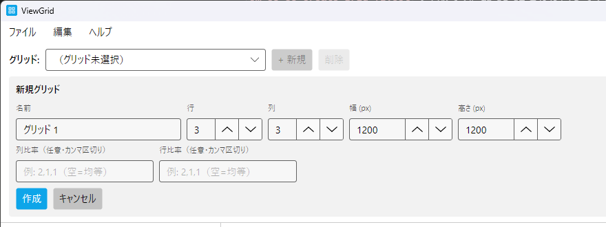
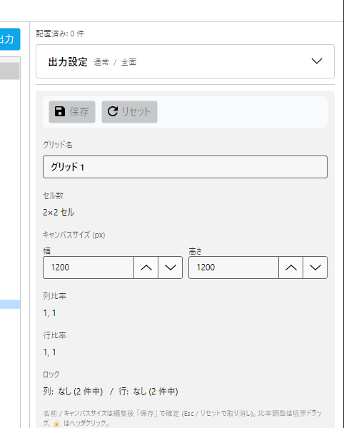
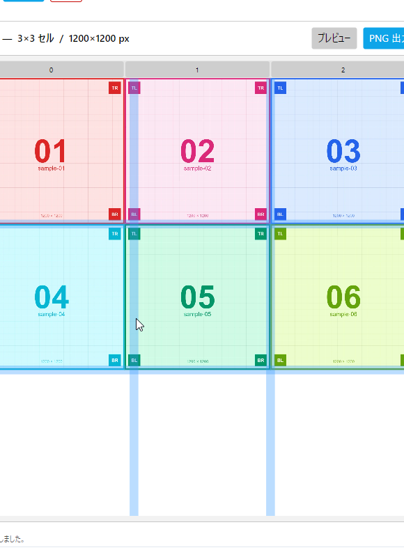

# §3 グリッド

グリッド (NxM のキャンバス) の作成・編集・切替を解説します。

## 3.6 グリッド作成 / 編集

### 3.6.1 新規グリッド作成

左ペイン上の **+ 新規** ボタン (`Ctrl+N`) で作成フライアウトが開きます。

| 項目 | 説明 | 既定値 |
|---|---|---|
| 名前 | グリッドの表示名 | グリッド N (自動採番) |
| 列 / 行 | グリッドの分割数 | 3 / 3 |
| キャンバス幅 / 高さ (px) | 出力 PNG の最大寸法 | 1200 / 1200 |
| 列比率 / 行比率 | カンマ区切りで個別指定可 (空なら均等) | (空) |

<!-- CAPTURE
file: docs/images/um/um-03-06-create-grid-flyout.png
size: 880x330 (左ペイン拡大、 グリッド作成フライアウト全体)
crop: 0,0,880,330
samples: (サンプル画像不要、 UI のみ)
state:
  - 作成フライアウト展開、 既定値そのまま (グリッド N / 3×3 / 1200×1200)
  - 言語: 日本語
caption: 新規グリッド作成フライアウト
note: 全フィールドと作成 / キャンセルボタンが見える
-->

### 3.6.2 グリッド名 / キャンバスサイズの編集

右ペイン (グリッドのみを選択した状態) の **グリッド設定** で名前 / キャンバスサイズを編集できます。 ドラフト編集 → **保存** ボタンで確定 (Esc / リセットで取り消し)。

<!-- CAPTURE
file: docs/images/um/um-03-06-grid-properties.png
size: 482x600 (右ペイン拡大、 グリッドプロパティ表示)
crop: 960,100,482,600
samples: (サンプル画像不要、 グリッドのみ選択)
state:
  - グリッド選択中 (配置なし or 配置あり問わず)、 右ペインにグリッド設定が表示
  - 名前を編集してドラフト状態 (● バッジ表示)
caption: 右ペインのグリッド設定 (ドラフト編集 + 保存ボタン)
-->

## 3.7 列・行の比率調整 (Weights)

### 3.7.1 境界ドラッグ

セル間の境界線にマウスを近づけるとカーソルがリサイズ形状に変わります。 そのままドラッグで左右 / 上下のセル幅を調整できます。

<!-- CAPTURE
file: docs/images/um/um-03-07-boundary-drag.png
size: 580x790 (キャンバスエリア拡大)
crop: 390,100,580,790
samples: sample-01〜06 (3×3 のうち 6 セル配置済み、 grid 線で境界の動きが視認可能)
state:
  - グリッド 3×3 (1500×1500 程度のキャンバス) に sample-01〜06 を配置
  - 中央列の左境界をドラッグ中、 境界線が太く強調表示
  - sample 画像の grid 線で境界の動きが pixel 単位で読み取れる
caption: 境界ドラッグで列幅を調整
-->

### 3.7.2 ロック (🔒) との関係

各列・行のヘッダにある 🔒 トグルでロックすると、 そのセルの幅 / 高さは境界ドラッグや 「占有セルへのフィット」 で変動しなくなります。

ロック中のセルに隣接する境界線は **オレンジ色** に変わり、 動かないことを示します。

→ §4.13 [配置のフィット (FitGridWeight)](04-placements.md)

#### ロックの効く / 効かない操作

| 操作 | ロックの影響 |
|---|---|
| 境界ドラッグ | ロック隣接の境界はドラッグ不可 (オレンジ表示) |
| グリッドフィット (Inspector) | ロック列 / 行はスキップ、 余白を非ロック側に分配 |
| キャンバスサイズ変更 | 影響なし (比率を維持したまま等倍拡縮するので) |
| グリッド再作成 | 影響なし (新規グリッドはロックなしで作成) |

#### ロック使用の典型例

- **ヘッダ行を固定**: 1 行目を特定の高さでロック → 残り行で配置を自由に調整
- **均等配置を保護**: 同サイズで並べた配置を境界ドラッグでうっかり崩さないようにロック
- **片側だけ柔軟に**: 中央 1 列だけ非ロック、 左右はロックして 「中央列の幅だけ調整可能」 な状態に

## 3.8 グリッド一覧 (左ペイン)

### 3.8.1 切替

リストからクリックで切替。 切替時に未保存の編集があれば自動 flush されます。

### 3.8.2 リネーム

グリッド名をダブルクリックでインラインリネーム。 または右ペイン グリッド設定から編集。

### 3.8.3 削除

リスト項目右のメニュー → 削除。 cascade で配置も消えるため確認ダイアログが出ます。 履歴は全消去 (削除操作は Undo 対象外)。

### 3.8.4 起動時の復元

最後に開いていたグリッドは `LastOpenedGridId` 設定として永続化され、 次回起動時に自動的に選択されます。

切替条件:
- グリッドが存在 (削除済みでない) → そのグリッドをアクティブに
- グリッドが見つからない → グリッド一覧の先頭をアクティブに
- グリッドが 1 件もない → 何も選択しない (新規作成を促す)

## 3.9 キャンバスサイズの編集

グリッドの **キャンバスサイズ** (出力 PNG の縦横ピクセル数) は右ペインから編集できます。

### 3.9.1 ドラフト編集と保存

- 数値入力 → ドラフト状態 (● 未保存バッジ表示)
- **保存** ボタンで永続化 + 履歴に積む
- **リセット** / `Esc` でドラフト破棄

### 3.9.2 ドラフト中の挙動

ドラフト中もキャンバス全体のサイズは変わらず、 **比率を維持したまま等倍拡縮** される表示になります (列・行の重みは変えないので、 各セルが同じ比率で拡大 / 縮小される)。

つまり 1200×1200 を 2000×2000 に変えても、 各配置の **占有セル割合** は同じです。 違いは出力 PNG の絶対ピクセル数だけ。

### 3.9.3 制約

- 最小: 100×100 px
- 最大: 8192×8192 px (実用上の上限。 これより大きいと PhotoBoard 合成が著しく遅くなる)
- 縦横比は自由
