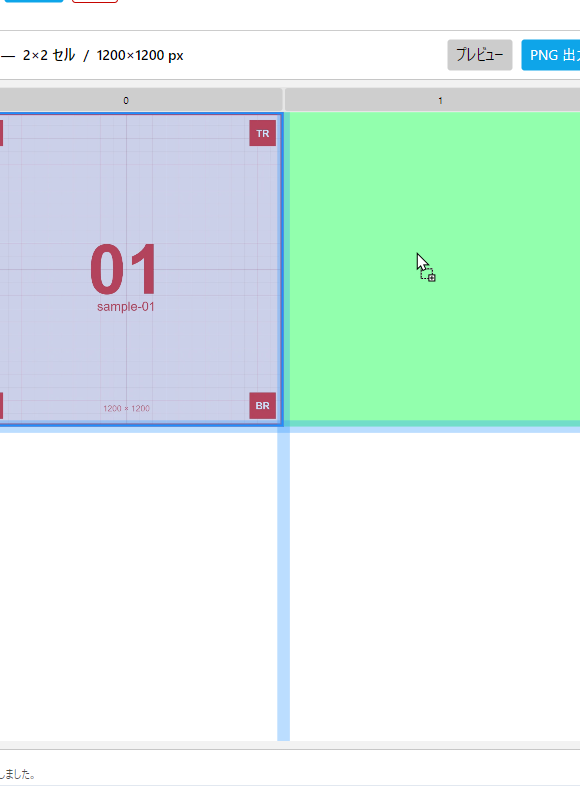
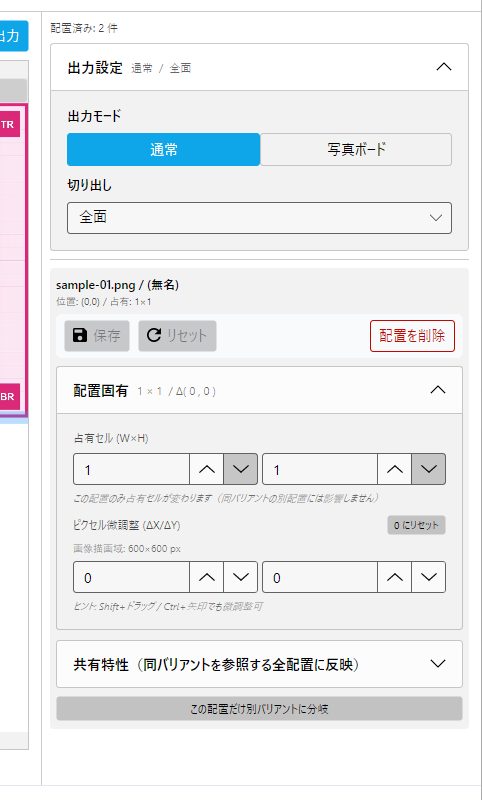

# §4 配置 (Placement)

バリアントをグリッドの特定セルに置いた実体である **配置** の操作を解説します。 共有特性 (バリアント単位) との対比については §1.2 を参照。

## 4.9 配置の作成 / 移動 / 削除

### 4.9.1 配置作成 (D&D)

候補リストからバリアントをセルへドラッグ&ドロップ。 セルにホバーすると **緑色** でハイライトされ、 ドロップ可能を示します。

複数セルを占有する配置 (W×H が 2×1 等) では、 占有予定のセル群が一括ハイライトされます。 範囲外や他配置と重複するときは **赤色** で不可表示。



<!-- CAPTURE
file: docs/images/um/um-04-09-drop-valid.png
size: 580x790 (キャンバスエリア拡大)
crop: 390,100,580,790
samples: sample-01 (配置済み), sample-02 (ドラッグ中)
state:
  - sample-01 が左上セルに配置済み
  - 候補から sample-02 をドラッグ中、 右上 1×1 セルにホバーで緑ハイライト
caption: 有効なドロップ先のホバー (緑ハイライト)
-->

### 4.9.2 配置の移動 / 入れ替え

- **移動**: 配置済みセルを掴んで空セルへドラッグ。 マウス位置とセル境界からのオフセットを保持
- **入れ替え (Swap)**: 別の配置済みセル上にドロップすると、 両者の位置が入れ替わります
- **キーボード配置**: 候補を選択して `Enter` を押すと、 最初の空きセルに自動配置

### 4.9.3 配置の選択 / 解除

- 配置をクリック → 選択 (右ペインに Inspector が開く)
- `Esc` → 選択解除

### 4.9.4 配置の削除

選択中の配置を Inspector 上部の **配置を削除** ボタンで削除。 `Delete` キーでも可能。 履歴に積まれるので Undo 可能。

## 4.10 配置固有特性 (Inspector)

選択中の配置の右ペインに表示される編集パネル。



<!-- CAPTURE
file: docs/images/um/um-04-10-inspector.png
size: 482x800 (右ペイン拡大、 Inspector)
crop: 960,100,482,800
samples: sample-01 (配置 + 選択中)
state:
  - sample-01 を配置 + 選択中、 Inspector 表示
  - 「配置固有」 Expander 展開済み (占有セル + ピクセル微調整)
  - 「共有特性」 Expander 折り畳み済み (出力設定と同じ折り畳みパターン)
caption: Inspector の構造 (配置固有 + 共有特性、 上部に保存バー + 配置削除)
-->

### 4.10.1 占有セル (OccupySize)

W×H で指定。 「1×1」 なら 1 セル、 「2×2」 なら 4 セル占有。 同じバリアントを別グリッド・別位置に配置しても、 占有セルは配置単位で独立しています。

#### 拡張時の制約

占有セルを増やす操作 (例: 1×1 → 2×2) は以下の場合に **拒否** されます。

- 拡張先のセル群がグリッド外に出る
- 拡張先のセルに別の配置が既にある (重複)

エラー時はステータスバーに 「占有セル 2×2 は配置 (1,2) でグリッド範囲外になります」 等のメッセージが表示され、 占有セルは変更されません。 縮小 (2×2 → 1×1) は常に成功します。

#### よくあるパターン

- **横長画像をワイドに置く**: 1×1 で配置 → 占有セルを 2×1 に変更 → 隣接列を拡大して画像を大きく
- **背景画像として全面に**: 占有セルを N×M (グリッド全体) に変更

### 4.10.2 ピクセル微調整 (PixelOffset)

セル境界からの ΔX / ΔY をピクセル単位で指定。 配置済み画像の表示位置を細かく動かせます。

操作方法:
- 数値入力 + `Enter`
- 配置を `Shift` + ドラッグ
- 配置選択中に `Ctrl + 矢印` (1px) / `Ctrl + Shift + 矢印` (10px)
- `0 にリセット` ボタンで戻す

### 4.10.3 保存バー + 配置を削除

Inspector 最上部に **保存** ボタンと **配置を削除** ボタンが固定表示されます。 占有セル / ピクセル微調整は **ドラフト編集** で、 保存ボタン押下まで反映されません。

#### ドラフト編集の挙動

- 数値入力時点では DB には書き込まず、 Inspector 内のみで値を保持
- **● 未保存の変更** バッジが表示される (ステータスバー)
- 保存ボタンで永続化 + 履歴に積む
- 別の配置を選択 / グリッド切替 / アプリ終了 のいずれかで **自動 flush** (内部的に保存される)
- Esc キーやリセットボタンでドラフトを破棄

ドラッグ系操作 (Shift+ドラッグ / Ctrl+矢印) は逆に **即座に永続化** されます (ドラフト経由しない)。 これは見た目の動きと保存タイミングを一致させるためです。

#### 自動保存 (実験的)

設定で **自動保存を有効にする** を ON にすると、 ドラフト編集も値が変わる度に自動で flush されます (debounce つき)。 保存ボタンを押す手間を省きたい場合に。

→ §9.26.3 [自動保存](09-settings.md)

## 4.11 共有特性 (Inspector 内 Expander)

Inspector の下部 Expander には選択中配置のバリアントの **共有特性** が展開されます。 ここで編集すると **同じバリアントを参照する他の配置にも影響** することに注意。

→ §5 [共有特性](05-shared-properties.md) で詳述

## 4.12 配置の位置・サイズ表示

Inspector 上部にラベルで **位置 / 占有 / 描画域** が表示されます。

```
位置: (0,0) / 占有: 1×1
画像描画域: 560×400 px
```

- 位置: グリッド内のセル座標 (左上が `(0,0)`)
- 占有: W×H セル数
- 描画域: PixelOffset を含まない実描画ピクセル寸法 (Scaling/Alignment の結果)

## 4.13 グリッド重みフィット (FitGridWeight)

配置の実描画矩形に合わせて、 占有列幅 / 行高を縮める機能。

- 操作: 配置選択中に列ヘッダ or 行ヘッダの **フィット** ボタン
- 余白は隣接列 / 行に分配 (端列の片側は破棄)
- ロック列 / 行はスキップされる
- Undo で旧重みに戻る

→ §3.7.2 [ロックとの関係](03-grids.md)

## 4.14 バリアント分岐 (Fork)

Inspector 下部の **この配置だけ別バリアントに分岐** ボタン。 現在のバリアントを複製した新しいバリアントを作って、 この配置だけを切り替えます。 元バリアントを参照する他の配置には影響しません。

### 4.14.1 動作の流れ

```
[Fork 前]
バリアント A
  ├── 配置 P1   (このまま)
  ├── 配置 P2   ← Fork 対象
  └── 配置 P3   (このまま)

[Fork 後]
バリアント A
  ├── 配置 P1   (このまま)
  └── 配置 P3   (このまま)
バリアント A' (= A の複製、 独立に編集可能)
  └── 配置 P2   ← 新バリアントに付け替え
```

新バリアント名は自動採番 (例: 「バリアント 2」)。 候補リストに即座に追加されます。

### 4.14.2 ユースケース

- **共通設定からの派生**: 1 つのアセットを 「人物中心クロップ」 と 「風景中心クロップ」 で同じグリッド内に並べたい
- **既存配置を壊さず実験**: 共有特性を変えて試したいが、 他配置への影響を避けたい
- **微差バリエーション**: 同じ被写体で回転だけ違うものを並べる比較画像

### 4.14.3 注意点

- Fork は履歴に積まれるので Undo 可能
- Fork 後の新バリアントは候補リストに残るため、 他の配置から D&D で参照することも可能 (= 単なる 「独立コピー」 として扱える)
- 新バリアントを参照する配置がゼロになっても、 バリアントは自動削除されません (候補リストから明示的に削除する必要あり)
