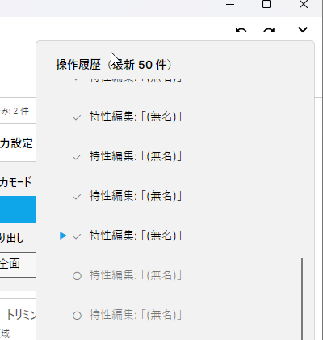

# §8 操作履歴

Undo / Redo と履歴 Flyout の使い方を解説します。

## 8.24 Undo / Redo

### 8.24.1 操作方法

| 操作 | キーボード | メニュー / UI |
|---|---|---|
| Undo (元に戻す) | `Ctrl + Z` | **編集 → 元に戻す** / ツールバー左矢印 |
| Redo (やり直し) | `Ctrl + Y` | **編集 → やり直し** / ツールバー右矢印 |

メニュー項目には次に取り消す / やり直す操作の説明が動的に表示されます (例: 「元に戻す: 配置: 「(無名)」→ (0,0)」、 バリアントに名前が付いていればその名前)。

### 8.24.2 Undo 対象になる操作

- 配置の作成 / 移動 / 入れ替え / 削除
- 占有セル変更 / ピクセル微調整
- 共有特性編集 (回転 / 反転 / スケーリング / トリミング / 保護領域)
- グリッド重み変更 / ロック切替 / フィット
- グリッド名変更 / キャンバスサイズ変更
- バリアント名変更 / バリアント分岐

### 8.24.3 Undo 対象外の操作

- 画像の取り込み / 削除
- グリッドの新規作成 / 削除
- バリアントの新規作成 / 削除
- ワークスペース操作全般
- 設定変更

これらは cascade 影響が大きい / 履歴矛盾を起こすため履歴全消去で扱われます。

## 8.25 履歴 Flyout

ステータスバー右側の **履歴サマリ** (例: 「履歴: 5/10」) クリックで Flyout が開きます。

<!-- CAPTURE
file: docs/images/um/um-08-25-history-flyout.png
size: 400x420 (Flyout 実サイズ + 周辺余白)
crop: 1042,10,400,420
samples: sample-01〜05 (操作履歴を 10 件積むためのアセット)
state:
  - 撮影前準備: sample-01.png のバリアントを「赤」、 sample-02.png を「青」 に F2 リネーム (残りは「(無名)」のまま)
  - sample-01〜05 を使って配置 / 削除 / 列幅変更などの操作を 10 件積んだ後
  - 履歴 10 件表示、 現在位置 5 番目 (5 件 Undo 済み)
  - 各エントリの description は History_*Fmt の出力。 例: 「配置: 「赤」→ (0,0)」、 「削除: 「(無名)」 (1,0)」、 「列幅変更: グリッド「グリッド 1」」 等
  - 5 番目以降は redo 候補としてグレーアウト
caption: 履歴 Flyout (最新 50 件表示、 ジャンプ用)
-->

### 8.25.1 一括ジャンプ

履歴エントリをクリックすると **その位置まで一括 Undo / Redo** されます (途中の操作をスキップする形)。

### 8.25.2 別グリッドへの自動切替

Undo 対象が別グリッドの操作の場合、 自動的にそのグリッドへ切り替わってから Undo / Redo します。 履歴を辿ると複数グリッドを横断的に再生する形になります。

### 8.25.3 最新 50 件まで表示

履歴自体は内部的にメモリに保持されますが、 Flyout は最新 50 件のみ表示。 アプリ再起動で履歴は消えます (永続化されない)。

### 8.25.4 履歴 description の言語

各履歴エントリの説明文 (例: 「リネーム: 「Grid 1」→「Working」」) は **操作実行時のアプリ言語** で記録されます。 後から言語を切り替えても、 既存履歴の説明文は撮影時の言語のまま残ります (履歴は再作成されない)。

## 8.26 永続化と Undo 対象外

### 8.26.1 Undo / Redo されるもの

- 配置 (作成 / 移動 / 入替 / 削除)
- 配置固有特性 (占有セル / ピクセル微調整)
- 共有特性 (回転 / 反転 / スケーリング / アライメント / トリミング / 保護領域)
- グリッド (リネーム / キャンバスサイズ / 重み / ロック / フィット)
- バリアント (名前変更 / Fork)

### 8.26.2 履歴全消去操作

以下の操作は cascade 削除を伴うため、 履歴を全消去してから実行されます (実行前のステータスに復元する手段はありません):

- アセット取り込み / 削除
- バリアント作成 / 削除
- グリッド作成 / 削除
- ワークスペース切替

これらを実行する前に重要な状態は PNG として書き出しておくとリカバリ可能です。

### 8.26.3 履歴の永続化

履歴は **メモリのみ** に保持され、 DB には保存されません。 アプリ終了で消えます。 これは:

- 履歴が積み重なるとメモリを圧迫する
- 別セッションでの履歴復元は cascade の整合性が壊れる可能性がある

ため、 セッション内のみの限定的な機能としています。
