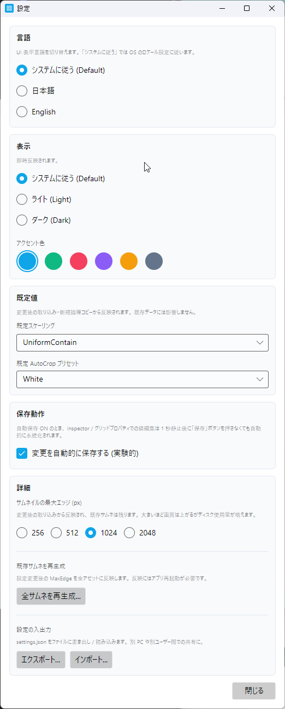

# §9 設定

アプリ全体の挙動を変える設定ダイアログを解説します。 設定は **ワークスペース横断で共有** されます (個人単位のため)。

## 設定の保存場所と性質

- 物理パス: `%LocalAppData%\ViewGrid\settings.json`
- 保存タイミング: 各項目の変更時に **即座に書き込み** (debounce つき)。 OK / キャンセルボタンはなし
- ワークスペース切替で値は **維持** (個人の好み単位の設定なので、 仕事用 / 趣味用で違うテーマにはなりません)
- アンインストール時は保持される (`%LocalAppData%\ViewGrid\` 全体を手動削除で完全リセット)

## 9.26 アプリ設定ダイアログ

**ファイル → 設定...** で `SettingsDialog` を開きます。 OK / キャンセルボタンはなく、 変更は即座に保存されます。



<!-- CAPTURE
file: docs/images/um/um-09-26-settings-dialog.png
size: ダイアログ実サイズ (520x560、 上から見える分のみ)
samples: (サンプル画像不要、 ダイアログのみ)
state:
  - 設定ダイアログを開いた直後 (既定サイズ 520x560)
  - 上から見える 3 セクション: 言語 / 表示 (テーマ + アクセント色)
  - 言語: システムに従う (Default) 選択中
  - テーマ: システムに従う (Default) 選択中
  - アクセント色: Blue (既定値) 選択中
caption: 設定ダイアログ (上半分: 言語 / 表示 セクション)
note: 既定 520x560 で開いた状態。 残りのセクション (既定値 / 保存動作 / 詳細 / 設定の入出力) はスクロールで表示。 本文側で「ダイアログ内をスクロールすると...」と補足するか、 別途下半分の撮影を追加する選択肢あり
-->

### 9.26.1 外観

#### テーマ

Light / Dark / System の 3 択。 即時反映 (アプリ再起動不要)。

| 値 | 挙動 |
|---|---|
| **Light** | 明るい背景 + 暗いテキスト (既定) |
| **Dark** | 暗い背景 + 明るいテキスト |
| **System** | OS のテーマ設定に追従 (Windows 11 設定 → 個人用設定 → 色 → モード) |

サンプル画像のグリッド線等は両テーマで視認しやすい色を選んでいますが、 PhotoBoard の出力 PNG は **テーマと無関係** に固定の見た目になります (印刷物としての最終出力なので)。

#### アクセント色

6 種類のプリセット。 ボタン強調色 / 選択枠 / リンク色等の主要 UI 要素に反映。

| プリセット | 色 (おおよそ) | 用途感 |
|---|---|---|
| **Blue** | #2563EB (既定) | 業務的な落ち着き |
| **Sky** | #0EA5E9 | やや明るく爽やか |
| **Emerald** | #059669 | 緑系、 自然 |
| **Violet** | #7C3AED | クリエイティブ |
| **Amber** | #D97706 | 暖かみ |
| **Rose** | #E11D48 | ビビッド |

色プリセットは小さなドット表示でクリック選択。 即時反映され、 一度クリックすれば DB に永続化されます。

### 9.26.2 既定値

新規バリアント / AutoCrop 作成時の初期値を変えられます。 既存バリアントには影響しません。

#### 既定スケーリング

新規アセット取り込み時に自動作成される 「既定バリアント」 のスケーリングモード初期値です。 6 モード ([§5.11.1](05-shared-properties.md) 参照) から選択。

| 状況 | 推奨既定 |
|---|---|
| 同サイズ画像が多い | 「原寸固定」 |
| 縦横比がバラバラ | 「アスペクト維持 (収める)」 (既定) |
| SNS サムネ用途中心 | 「アスペクト維持 (覆う・切り取り)」 |

#### AutoCrop 既定プリセット

AutoCrop を ON にしたときに最初に選択される対象色プリセット。 White / Black / Transparent から選択 (Custom は除く)。

スキャン画像主体の利用なら White、 透過 PNG 主体なら Transparent、 等で日々のクリック数を減らせます。

### 9.26.3 自動保存

#### 既定の挙動 (OFF)

Inspector や特性編集タブのドラフト編集は **保存ボタン押下** または **別項目への切替** で自動 flush。 通常のワークフローでは押し忘れがあっても切替時に救済されます。

#### ON にすると

値が変わる度に **debounce 付き** で自動保存されます (連続入力でもバッチで 1 回に集約)。

| 利点 | 欠点 |
|---|---|
| 保存ボタンを押し忘れる事故が減る | 編集途中の不確定な値も履歴に積まれる |
| ドラフト ● バッジが頻繁に消えるので心理的安心感 | 数値入力の途中値で履歴汚染 (Undo 階段が増える) |
| Crash 耐性が上がる | 履歴消費メモリが増える |

#### 推奨

- **慎重な編集を好む人**: 既定 OFF のまま
- **数値入力多用 + 履歴汚染気にしない人**: ON
- 実験的扱いのため、 ある程度の race 残存リスクあり (詳細は HANDOFF/pending-designs.md 参照)

### 9.26.4 言語

3 つから選択 (ラジオボタン):

| 値 | 挙動 |
|---|---|
| **system** | OS の言語設定に追従。 `ja-*` (例: `ja-JP`) なら日本語、 その他は英語 |
| **ja** | 日本語固定 |
| **en** | 英語固定 |

#### 即時切替の対象範囲

変更は **アプリ再起動なしで全 UI に即時反映** されます (i18n Phase 1〜3+ で対応)。 具体的には:

✅ 即時切替対象:
- メニューバー / ステータスバー / ヒント
- 設定ダイアログ / About ダイアログ / ライセンス情報
- 各種ダイアログのタイトル / ボタン
- グリッドプロパティ / Inspector / 配置情報の各ラベル
- Converter 経由のラベル (スケーリングモード等は次回再評価時に反映)

⚠️ 再ロードまで古い文言が残るもの:
- 候補リストのバリアント表示名 (アセット名は不変、 表示形式のみ後ロードで反映)
- 操作履歴の description (実行時の言語で固定、 言語切替では更新されない)

⚠️ DB に保存される文字列で言語非依存のもの:
- グリッド名 / バリアント名 / 既定バリアントの 「バリアント 1」 等の採番文字列 — これらは作成時の言語で永続化され、 言語切替しても再採番されません

#### 言語切替後の運用

言語を切り替えたら、 違和感のある古い文言が残る場合は **アプリ再起動** または **ワークスペース切替** で全面再ロードしてください。

### 9.26.5 サムネ再生成

**サムネ一括再生成** ボタンで全アセットのサムネを再生成。 進捗ダイアログが表示され、 キャンセル可能。 完了後はアプリ再起動を推奨。

→ §10.29 [トラブルシューティング (サムネ不整合)](10-reference.md)

#### 実行のタイミング

サムネは取り込み時に自動生成されるため、 通常は再生成不要です。 以下のケースで実行:

- **サムネが壊れている**: 候補リストや配置プレビューで一部のサムネが空白 / 黒矩形 / 古い画像のまま
- **取り込み中にクラッシュ**: アプリが落ちて中途半端なサムネが残った
- **手動でサムネファイルを消した後**: 開発者の手動操作後の整合性回復

#### 所要時間

アセット 1 件あたり約 100〜300ms。 100 件で 10〜30 秒程度の目安。 大量にあると数分かかります。 途中キャンセル可能。

#### 完了後

進捗ダイアログ完了画面で 「再起動を推奨」 が表示されます。 メモリ上の古いサムネキャッシュをクリアするため、 アプリ再起動するとより確実です。

## 9.27 設定の入出力 (JSON)

### 9.27.1 エクスポート

**エクスポート...** ボタン → 保存先 JSON ファイル指定。 現在の AppSettings 全体を 1 つの JSON に書き出します。

#### 出力例

```json
{
  "Theme": "Light",
  "AccentColor": "Blue",
  "Language": "ja",
  "DefaultScalingMode": "UniformContain",
  "AutoCropDefaultPreset": "White",
  "EnableAutoSave": false,
  "LastOpenedGridId": "..."
}
```

> `LastOpenedGridId` のような **環境固有値** は他 PC ではそのまま使えませんが、 該当グリッドが存在しなければ自動で 「先頭グリッド」 にフォールバックされます。

### 9.27.2 インポート

**インポート...** ボタン → JSON ファイル選択。 ファイル内容で AppSettings を全置換 + ダイアログ表示も即時更新。

#### インポート時の挙動

- ファイル全体が解析できなければ拒否 (「JSON が空または不正です」)
- 解析できれば現設定を **完全置換** (部分マージではない)
- アクセント色 / テーマ / 言語が即時反映
- 不明な enum 値があれば例外で拒否

#### 失敗時の復旧

インポートが失敗した場合、 現設定は変更されません。 もし設定が壊れた状態でアプリが起動できなくなったら、 `%LocalAppData%\ViewGrid\settings.json` を手動削除 → 既定値で再生成。

### 9.27.3 JSON フォーマット

- `WriteIndented = true` で人間が手編集可能
- enum は文字列表現 (`Fill` 等のラベルが安定、 バージョン間互換)
- ファイル名既定: `viewgrid-settings.json`

#### バージョン間互換性

ViewGrid のバージョンアップで設定キーが増えても、 古い JSON は **そのままインポート可能** です (新しいキーは既定値で補完される)。 逆に新しい JSON を古いバージョンへインポートすると、 未知のキーは無視されます。

### 9.27.4 ユースケース

- 別 PC / 別ユーザー間での設定共有
- 設定リセット用のバックアップ
- チーム内でのテーマ統一 / プリセット配布

ワークスペース (画像 / グリッドデータ) と異なり、 settings.json はテキストの設定ファイルのみなので、 メールやチャットで気軽に送信できます。
